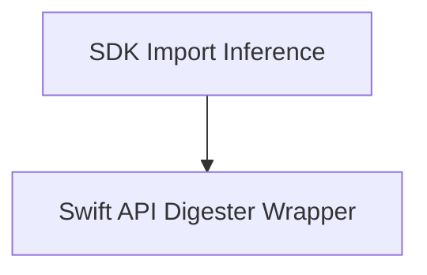

# API Checker Utilities Module

The `api_checker_utilities` module provides essential tools for analyzing and maintaining API stability within SDKs, particularly for Swift and Clang environments. It automates the process of inferring module imports and acting as a wrapper for the `swift-api-digester` tool to track and diagnose API changes.

## Architecture Overview

The `api_checker_utilities` module is composed of two primary sub-modules, each handling distinct aspects of API analysis:

<!-- DIAGRAM_JSON
{
    "direction": "TD",
    "nodes": [
        {"id": "sdk_import_inference", "label": "SDK Import Inference", "type": "module", "link": "sdk_import_inference.md"},
        {"id": "swift_api_digester_wrapper", "label": "Swift API Digester Wrapper", "type": "module", "link": "swift_api_digester_wrapper.md"}
    ],
    "edges": [
        {"source": "sdk_import_inference", "target": "swift_api_digester_wrapper"}
    ],
    "groups": []
}
-->

## Sub-modules

### [SDK Import Inference](sdk_import_inference.md)
This sub-module is responsible for inferring module imports from a given SDK path. It can output imports in various formats suitable for Clang or Swift, and supports filtering to include only Swift frameworks, overlays, or Catalyst-specific frameworks.

### [Swift API Digester Wrapper](swift_api_digester_wrapper.md)
This sub-module provides a convenient command-line interface for interacting with the `swift-api-digester` tool. It enables actions such as dumping the API baseline of a Swift module for a specific target platform and Swift version, and diagnosing API changes by comparing two different API baselines.