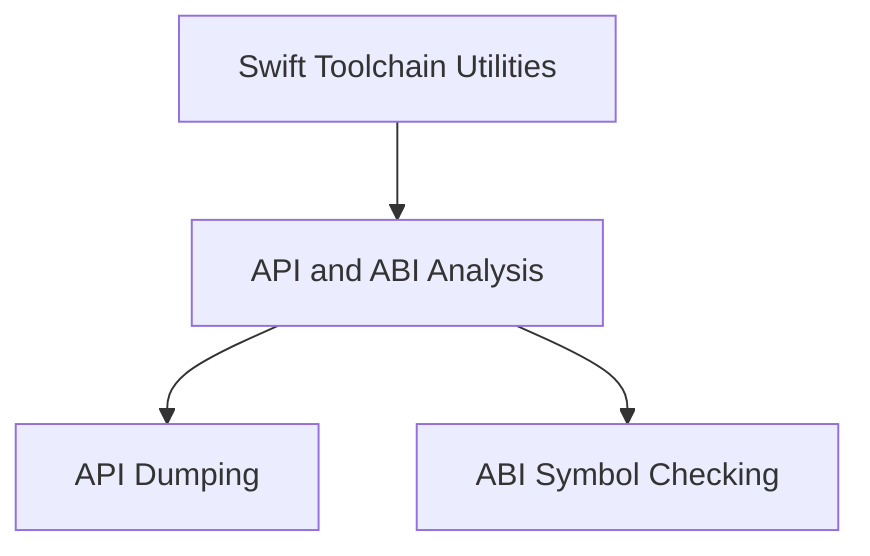

# `api_dumping` Module Documentation

## Introduction
The `api_dumping` module provides functionality for dumping the API of Swift modules. It leverages `swift-ide-test` to extract and format API information, allowing developers to inspect the public interfaces of Swift frameworks and libraries. This is crucial for maintaining API stability and for various analysis tasks.

## Purpose and Core Functionality
This module is primarily responsible for generating textual representations of Swift module APIs. It orchestrates calls to `swift-ide-test` with various options to control the output, such as skipping overlays, documentation comments, or unavailable symbols. It supports dumping APIs for different SDKs and targets, making it a versatile tool for cross-platform and multi-version API analysis.

## Architecture Overview
The `api_dumping` module is a core part of the larger `api_and_abi_analysis` system, which itself is a sub-module of `swift_toolchain_utilities`. It directly interacts with `swift-ide-test` to perform its primary function. Its outputs can then be consumed by other analysis tools for further processing or comparison.

<!-- DIAGRAM_JSON
{
    "direction": "TD",
    "nodes": [
        {"id": "swift_toolchain_utilities", "label": "Swift Toolchain Utilities", "type": "module", "link": "swift_toolchain_utilities.md"},
        {"id": "api_and_abi_analysis", "label": "API and ABI Analysis", "type": "module", "link": "api_and_abi_analysis.md"},
        {"id": "api_dumping", "label": "API Dumping", "type": "module", "link": "api_dumping.md"},
        {"id": "abi_symbol_checking", "label": "ABI Symbol Checking", "type": "module", "link": "abi_symbol_checking.md"}
    ],
    "edges": [
        {"source": "swift_toolchain_utilities", "target": "api_and_abi_analysis"},
        {"source": "api_and_abi_analysis", "target": "api_dumping"},
        {"source": "api_and_abi_analysis", "target": "abi_symbol_checking"}
    ],
    "groups": []
}
-->

## Components:

*   **`utils.swift-api-dump.main`**:
    This is the entry point for the API dumping utility. It parses command-line arguments, constructs the `swift-ide-test` command with various options (e.g., framework directories, include directories, Swift version), and manages the execution of multiple API dump jobs in parallel using a multiprocessing pool. It creates a temporary Swift source file, touches it, executes the `swift-ide-test` commands, and then cleans up the temporary file. This function provides the overall control flow for the API dumping process.

*   **`utils.swift-api-dump.dump_module_api_star`**:
    A wrapper function designed to facilitate the use of `dump_module_api` with `multiprocessing.Pool.map`. It unpacks a tuple of arguments (`pack`) and passes them to the actual `dump_module_api` function (which is assumed to exist elsewhere, likely a helper within the `swift-api-dump.py` file, but not provided in the core components). This enables parallel execution of API dumping tasks for different modules, SDKs, or targets.

## Relationship to other modules:
The `api_dumping` module is a sub-module of [api_and_abi_analysis.md](api_and_abi_analysis.md), contributing specific API dumping capabilities to the broader analysis toolkit. It also falls under the umbrella of [swift_toolchain_utilities.md](swift_toolchain_utilities.md), which encompasses various tools for managing and analyzing Swift toolchains. Its functionality is distinct from [abi_symbol_checking.md](abi_symbol_checking.md), which focuses on ABI symbol comparisons.