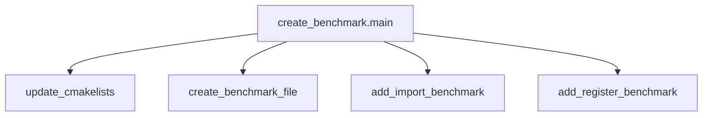

# benchmark_creation Module Documentation

## Introduction

The `benchmark_creation` module provides the core functionality for generating and setting up new performance benchmarks within the system. It automates the process of integrating new benchmarks by modifying necessary configuration files and creating the benchmark's source code.

## Core Functionality

The primary function of this module, `benchmark.scripts.create_benchmark.main`, orchestrates the creation of a new benchmark. It handles the following key steps:

1.  **Argument Parsing**: It parses the benchmark name provided by the user.
2.  **CMakeLists.txt Update**: It modifies the `CMakeLists.txt` file to include the newly created benchmark, ensuring it's part of the build system.
3.  **Benchmark File Creation**: It generates a new Swift source file for the benchmark, providing a template for performance testing.
4.  **Main Swift File Integration**: It updates the `main.swift` file by adding an import statement for the new benchmark module and registering it with the benchmark driver, making it discoverable and executable.

This module streamlines the benchmark creation workflow, reducing manual errors and ensuring consistency across new benchmarks.

## Architecture and Component Relationships

The `benchmark_creation` module's architecture is centered around its `main` function, which sequentially calls several helper functions to achieve its goal.

<!-- DIAGRAM_JSON
{
    "direction": "TD",
    "nodes": [
        {"id": "create_benchmark_main", "label": "create_benchmark.main", "type": "component", "link": null},
        {"id": "update_cmakelists_func", "label": "update_cmakelists", "type": "component", "link": null},
        {"id": "create_benchmark_file_func", "label": "create_benchmark_file", "type": "component", "link": null},
        {"id": "add_import_benchmark_func", "label": "add_import_benchmark", "type": "component", "link": null},
        {"id": "add_register_benchmark_func", "label": "add_register_benchmark", "type": "component", "link": null}
    ],
    "edges": [
        {"source": "create_benchmark_main", "target": "update_cmakelists_func"},
        {"source": "create_benchmark_main", "target": "create_benchmark_file_func"},
        {"source": "create_benchmark_main", "target": "add_import_benchmark_func"},
        {"source": "create_benchmark_main", "target": "add_register_benchmark_func"}
    ],
    "groups": []
}
-->

## Module Integration

The `benchmark_creation` module is a part of the larger `benchmark_scripts` family. It works in conjunction with other benchmark-related utilities to provide a complete system for performance testing.

Specifically, after a benchmark is created using this module, its performance can be analyzed and compared using the functionality provided by the [performance_comparison](performance_comparison.md) module.
