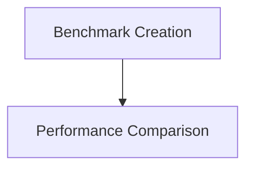

# Benchmark Scripts Module

## Introduction
The `benchmark_scripts` module provides a suite of tools designed to facilitate the creation, management, and analysis of performance benchmarks. It streamlines the process of adding new benchmarks to the system and offers utilities for comparing benchmark results to identify performance regressions or improvements.

## Architecture
The `benchmark_scripts` module is composed of two main sub-modules: `benchmark_creation` and `performance_comparison`. These sub-modules handle distinct aspects of benchmark management, from initial setup to post-execution analysis.

<!-- DIAGRAM_JSON
{
    "direction": "TD",
    "nodes": [
        {"id": "benchmark_creation", "label": "Benchmark Creation", "type": "module", "link": "benchmark_creation.md"},
        {"id": "performance_comparison", "label": "Performance Comparison", "type": "module", "link": "performance_comparison.md"}
    ],
    "edges": [
        {"source": "benchmark_creation", "target": "performance_comparison", "label": "creates benchmarks for"}
    ],
    "groups": []
}
-->

## Sub-modules

### Benchmark Creation
The `benchmark_creation` sub-module automates the process of creating new benchmark files and integrating them into the build system. It handles updating `CMakeLists.txt`, generating Swift benchmark files, and registering them with the benchmark driver. For more details, refer to [benchmark_creation.md](benchmark_creation.md).

### Performance Comparison
The `performance_comparison` sub-module focuses on analyzing and comparing the results of performance tests. It generates formatted reports, highlighting performance changes based on a defined delta threshold, which is crucial for identifying regressions or improvements. For more details, refer to [performance_comparison.md](performance_comparison.md).