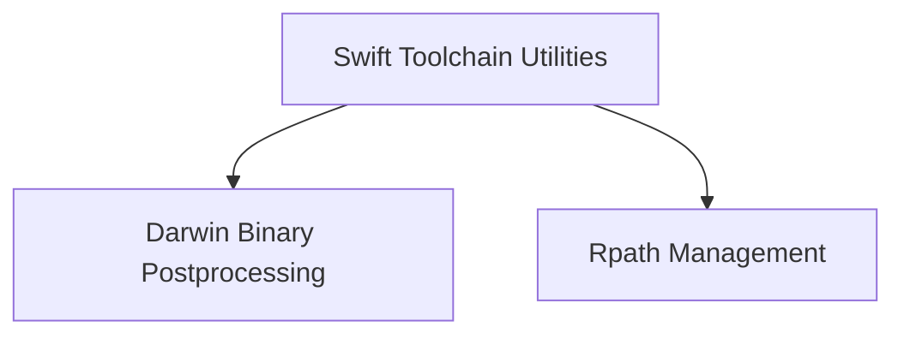

# Binary Postprocessing Module

## Introduction

The `binary_postprocessing` module is responsible for performing essential post-build operations on Swift binaries for Darwin platforms. This includes adjusting runtime search paths (rpaths) and applying code signatures, ensuring binaries are correctly prepared for execution and distribution.

## Architecture

This module is composed of two primary sub-modules, each handling a distinct aspect of binary post-processing: `darwin_postprocessing` for platform-specific preparations and `rpath_management` for handling dynamic library loading paths.

<!-- DIAGRAM_JSON
{
    "direction": "TD",
    "nodes": [
        {"id": "darwin_postprocessing", "label": "Darwin Binary Postprocessing", "type": "module", "link": "darwin_postprocessing.md"},
        {"id": "rpath_management", "label": "Rpath Management", "type": "module", "link": "rpath_management.md"},
        {"id": "swift_toolchain_utilities", "label": "Swift Toolchain Utilities", "type": "external", "link": "swift_toolchain_utilities.md"}
    ],
    "edges": [
        {"source": "swift_toolchain_utilities", "target": "darwin_postprocessing"},
        {"source": "swift_toolchain_utilities", "target": "rpath_management"}
    ],
    "groups": []
}
-->

## Sub-modules

### [Darwin Binary Postprocessing](darwin_postprocessing.md)
This sub-module focuses on preparing binaries specifically for Darwin operating systems. It handles critical steps like removing incorrect rpaths and applying necessary code signatures, which are vital for application security and proper loading on macOS and other Darwin-based platforms.

### [Rpath Management](rpath_management.md)
The `rpath_management` sub-module is dedicated to modifying the install names within binaries to utilize `@rpath`. This ensures that dynamic libraries are located correctly at runtime, promoting flexibility and portability of binaries by allowing relative path resolution.
