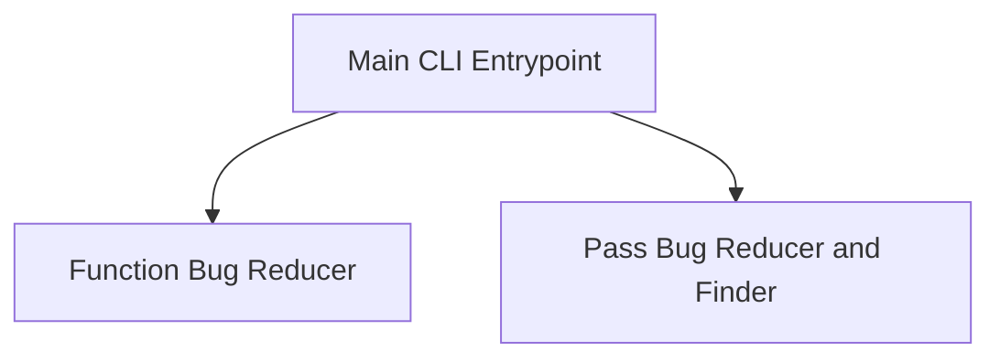

# Bug Reducer Tools Module

## Introduction

The `bug_reducer_tools` module provides a suite of utilities designed to automatically reduce and identify the root causes of bugs, particularly crashes related to the Swift Intermediate Language (SIL) compilation pipeline. It offers various strategies, including reducing function lists, optimizing pass lists, and employing random search techniques to pinpoint problematic code or compiler optimizations.

## Architecture

The module's architecture is centered around a main command-line interface that dispatches to specialized bug reduction components. These components interact with Swift compilation tools to iteratively narrow down the cause of a bug.

<!-- DIAGRAM_JSON
{
    "direction": "TD",
    "nodes": [
        {"id": "main_cli", "label": "Main CLI Entrypoint", "type": "module", "link": "main_cli.md"},
        {"id": "function_reducer", "label": "Function Bug Reducer", "type": "module", "link": "function_reducer.md"},
        {"id": "pass_reducer", "label": "Pass Bug Reducer and Finder", "type": "module", "link": "pass_reducer.md"}
    ],
    "edges": [
        {"source": "main_cli", "target": "function_reducer"},
        {"source": "main_cli", "target": "pass_reducer"}
    ],
    "groups": []
}
-->

## Sub-modules

### [Main CLI Entrypoint](main_cli.md)
Provides the primary command-line interface for interacting with the bug reduction tools. It parses arguments and directs execution to the appropriate bug reduction strategy.

### [Function Bug Reducer](function_reducer.md)
Focuses on reducing bugs by identifying a minimal set of functions within a Swift Intermediate Language (SIL) file that still trigger a crash or erroneous behavior under specific compiler passes. This helps isolate the problematic function(s).

### [Pass Bug Reducer and Finder](pass_reducer.md)
Handles bug reduction by simplifying the list of compiler passes applied during compilation, or by finding new bugs through random permutations of compiler passes. This module is crucial for identifying which specific optimization or analysis pass is responsible for a bug. It works in conjunction with [compiler_pass_analysis.md](compiler_pass_analysis.md) for deeper insights into compiler passes.
