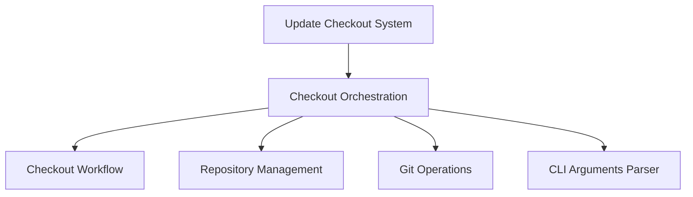

# Checkout Orchestration Module

## Introduction
The `checkout_orchestration` module is a critical component within the `update_checkout_system`. Its primary responsibility is to orchestrate the entire repository checkout and update process. This includes parsing command-line arguments, loading and validating configuration, handling cross-repository pull requests, cloning new repositories, and updating existing ones to the specified state or scheme.

## Architecture Overview
The `checkout_orchestration` module serves as the central control for managing the state of multiple Git repositories. It leverages configuration files to determine the desired state of various repositories and interacts with Git to perform necessary operations. It relies on `cli_arguments_parser` for handling command-line inputs and delegates repository-specific tasks to `repository_management` and low-level Git commands to `git_operations`. The core logic is encapsulated within the `checkout_workflow` sub-module.

<!-- DIAGRAM_JSON
{
    "direction": "TD",
    "nodes": [
        {"id": "checkout_orchestration", "label": "Checkout Orchestration", "type": "module"},
        {"id": "checkout_workflow", "label": "Checkout Workflow", "type": "module", "link": "checkout_workflow.md"},
        {"id": "update_checkout_system", "label": "Update Checkout System", "type": "module", "link": "update_checkout_system.md"},
        {"id": "repository_management", "label": "Repository Management", "type": "module", "link": "repository_management.md"},
        {"id": "git_operations", "label": "Git Operations", "type": "module", "link": "git_operations.md"},
        {"id": "cli_arguments_parser", "label": "CLI Arguments Parser", "type": "module", "link": "cli_arguments_parser.md"}
    ],
    "edges": [
        {"source": "checkout_orchestration", "target": "checkout_workflow"},
        {"source": "checkout_orchestration", "target": "repository_management"},
        {"source": "checkout_orchestration", "target": "git_operations"},
        {"source": "checkout_orchestration", "target": "cli_arguments_parser"},
        {"source": "update_checkout_system", "target": "checkout_orchestration"}
    ],
    "groups": []
}
-->

## Sub-modules

*   ### [Checkout Workflow](checkout_workflow.md)
    Manages the overall checkout process, including parsing arguments, configuration, repository cloning, and updating.
