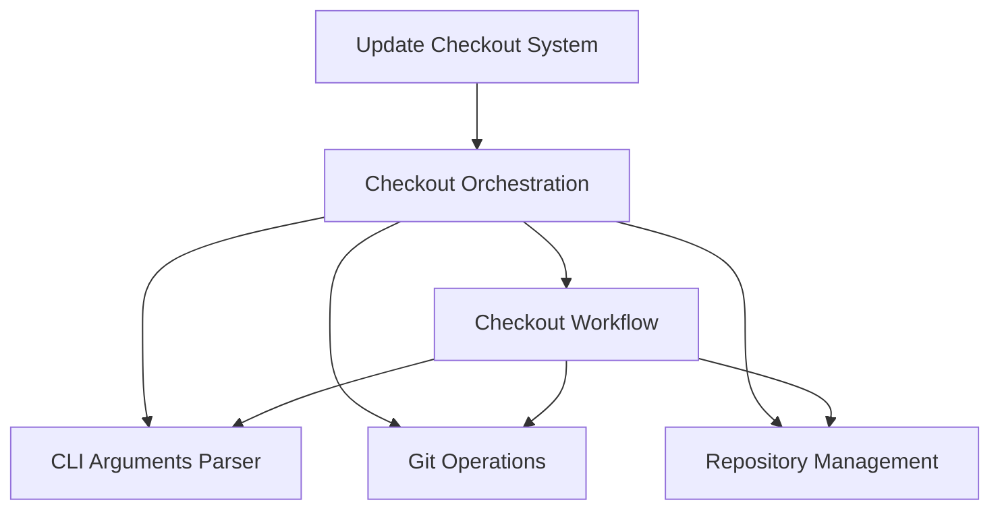

# Checkout Workflow

The `checkout_workflow` module is a critical component within the `update_checkout_system`, specifically residing under `checkout_orchestration`. Its primary role is to manage and execute the process of synchronizing and updating various source code repositories. This includes parsing command-line arguments, loading and validating configuration, and orchestrating the cloning and updating of repositories based on predefined schemes or specific pull requests.

## Architecture Overview

The `checkout_workflow` module operates as the central control flow for the repository management process. It is a direct child of the `checkout_orchestration` module and interacts heavily with other related components to perform its tasks. It relies on `cli_arguments_parser` to interpret user inputs, `git_operations` for all Git-related commands, and `repository_management` for the detailed handling of individual repository cloning and updating.

<!-- DIAGRAM_JSON
{
    "direction": "TD",
    "nodes": [
        {"id": "update_checkout_system", "label": "Update Checkout System", "type": "module", "link": "update_checkout_system.md"},
        {"id": "checkout_orchestration", "label": "Checkout Orchestration", "type": "module", "link": "checkout_orchestration.md"},
        {"id": "checkout_workflow", "label": "Checkout Workflow", "type": "module", "link": "checkout_workflow.md"},
        {"id": "cli_arguments_parser", "label": "CLI Arguments Parser", "type": "module", "link": "cli_arguments_parser.md"},
        {"id": "git_operations", "label": "Git Operations", "type": "module", "link": "git_operations.md"},
        {"id": "repository_management", "label": "Repository Management", "type": "module", "link": "repository_management.md"}
    ],
    "edges": [
        {"source": "update_checkout_system", "target": "checkout_orchestration"},
        {"source": "checkout_orchestration", "target": "checkout_workflow"},
        {"source": "checkout_orchestration", "target": "cli_arguments_parser"},
        {"source": "checkout_orchestration", "target": "git_operations"},
        {"source": "checkout_orchestration", "target": "repository_management"},
        {"source": "checkout_workflow", "target": "cli_arguments_parser"},
        {"source": "checkout_workflow", "target": "git_operations"},
        {"source": "checkout_workflow", "target": "repository_management"}
    ],
    "groups": []
}
-->

## Core Functionality

The `checkout_workflow` module provides the core logic for the `update-checkout` utility through its two main components:

### `utils.update_checkout.update_checkout.update_checkout.main`
This function serves as the primary entry point for the entire `update-checkout` utility. It is responsible for:
- Parsing command-line arguments using the `CliArguments` component (see [cli_arguments_parser.md](cli_arguments_parser.md)).
- Loading and merging configuration files to define repository schemes and other settings.
- Handling different command modes, such as "status."
- Detecting and processing cross-repository pull requests mentioned in GitHub comments.
- Orchestrating the initial cloning and subsequent updating of all configured repositories by calling `do_checkout`.
- Reporting the overall success or failure of the checkout process.

### `utils.update_checkout.update_checkout.update_checkout.do_checkout`
This inner function, invoked by `main`, encapsulates the detailed steps required to perform the actual repository checkout and update operations. Its responsibilities include:
- Managing a list of repositories to skip based on platform or user input.
- Obtaining additional Swift sources if specified, utilizing underlying Git operations (see [git_operations.md](git_operations.md)).
- Checking if the `swift` repository itself needs to switch to a cross-repository branch and re-reading the configuration if necessary.
- Handling requests to dump repository hashes for debugging or reporting purposes.
- Verifying that all necessary repositories have been cloned.
- Updating all configured repositories in parallel, leveraging components from [repository_management.md](repository_management.md).
- Aggregating and reporting the results of cloning and updating operations.

## Related Modules

For a broader understanding of how this module fits into the larger system, refer to the [update_checkout_system.md](update_checkout_system.md) documentation.
For details on argument parsing, see [cli_arguments_parser.md](cli_arguments_parser.md).
For Git command execution, see [git_operations.md](git_operations.md).
For repository-specific operations, see [repository_management.md](repository_management.md).
For the broader orchestration context, see [checkout_orchestration.md](checkout_orchestration.md).