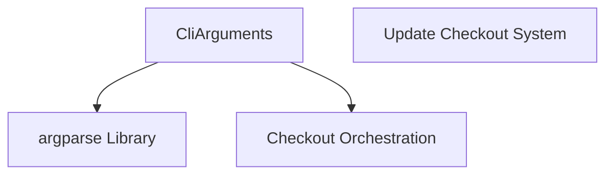

# CLI Arguments Parser Module

This module is responsible for defining and parsing command-line arguments for the `update_checkout` system. It provides a structured way to handle various options and flags that control the behavior of the checkout and update processes.

## Core Functionality

The `cli_arguments_parser` module primarily exposes the `CliArguments` class, which inherits from `argparse.Namespace`. This class serves two main purposes:

1.  **Argument Definition**: It defines all the expected command-line arguments, their types, default values, and help messages.
2.  **Argument Parsing**: The `parse_args` static method within `CliArguments` uses Python's `argparse` library to parse the command-line input and populate an instance of `CliArguments` with the user-provided values.

Key functionalities include:

*   **Repository Operations**: Options for cloning (`--clone`, `--clone-with-ssh`, `--partial-clone`), skipping repositories (`--skip-repository`), and managing history and tags (`--skip-history`, `--skip-tags`).
*   **State Management**: Arguments to reset (`--reset-to-remote`), clean (`--clean`), or stash (`--stash`) repository changes before updating.
*   **Configuration**: Support for loading multiple configuration files (`--config`) and specifying a branch scheme (`--scheme`).
*   **Information Output**: Options to dump Git hashes (`--dump-hashes`, `--dump-hashes-config`).
*   **Concurrency and Verbosity**: Control over the number of parallel processes (`-j`/`--jobs`) and logging verbosity (`-v`/`--verbose`).
*   **Subcommands**: Includes a `status` subcommand to print the status of all repositories.

## Architecture and Component Relationships

This module contains the `CliArguments` component, which is central to processing user input. It relies on the standard `argparse` Python library for its parsing capabilities.

<!-- DIAGRAM_JSON
{
    "direction": "TD",
    "nodes": [
        {"id": "cli_arguments", "label": "CliArguments", "type": "component", "link": null},
        {"id": "argparse_lib", "label": "argparse Library", "type": "external", "link": null},
        {"id": "checkout_orchestration", "label": "Checkout Orchestration", "type": "external", "link": "checkout_orchestration.md"},
        {"id": "update_checkout_system", "label": "Update Checkout System", "type": "external", "link": "update_checkout_system.md"}
    ],
    "edges": [
        {"source": "cli_arguments", "target": "argparse_lib"},
        {"source": "cli_arguments", "target": "checkout_orchestration"}
    ],
    "groups": []
}
-->

## How it Fits into the Overall System

The `cli_arguments_parser` module serves as the initial interface for the [update_checkout_system](update_checkout_system.md). When the `update_checkout` script is executed, this module is responsible for interpreting the command-line arguments provided by the user. The parsed arguments, encapsulated in a `CliArguments` object, are then passed to the [checkout_orchestration](checkout_orchestration.md) module, which uses them to determine the desired operations (e.g., cloning, updating, cleaning repositories) and orchestrate the overall workflow. This clear separation of concerns ensures that argument parsing is handled independently from the core logic of the update process.