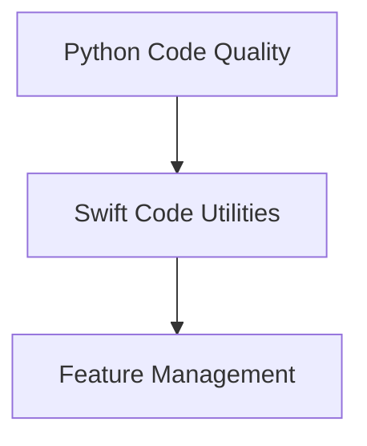

# Code Refactoring and Linting Module

## Introduction and Purpose

The `code_refactoring_and_linting` module provides a collection of utilities designed to improve code quality, automate refactoring tasks, and ensure adherence to coding standards across various programming languages, primarily Python and Swift. It includes tools for applying automated fixes, enforcing code style, linting, generating code artifacts, and verifying the correctness of refactored code.

This module aims to streamline development workflows by providing mechanisms for consistent code quality, reducing manual effort in code maintenance, and facilitating complex refactoring operations with compilation checks.

## Architecture Overview

The `code_refactoring_and_linting` module is composed of several sub-modules, each focusing on a specific aspect of code quality, refactoring, or utility generation. The overall architecture is designed to allow for independent development and deployment of these specialized tools, while providing a cohesive set of functionalities for developers.

<!-- DIAGRAM_JSON
{
    "direction": "TD",
    "nodes": [
        {"id": "python_code_quality", "label": "Python Code Quality", "type": "module", "link": "python_code_quality.md"},
        {"id": "swift_code_utilities", "label": "Swift Code Utilities", "type": "module", "link": "swift_code_utilities.md"},
        {"id": "feature_management", "label": "Feature Management", "type": "module", "link": "feature_management.md"}
    ],
    "edges": [
        {"source": "python_code_quality", "target": "swift_code_utilities"},
        {"source": "swift_code_utilities", "target": "feature_management"}
    ],
    "groups": []
}
-->

## Sub-modules

This module is organized into the following sub-modules, each with its specific responsibilities:

### [Python Code Quality](python_code_quality.md)
This sub-module focuses on maintaining high quality for Python codebases. It includes tools for automated code formatting and static analysis (linting) to ensure adherence to style guides and identify potential issues.

### [Swift Code Utilities](swift_code_utilities.md)
This sub-module provides specialized utilities for Swift code. It handles the application of automated 'fix-it' edits, generation of unicode confusables data crucial for Swift's parsing infrastructure, and a robust mechanism to verify that refactoring changes to Swift code do not introduce compilation errors.

### [Feature Management](feature_management.md)
This sub-module offers a utility for merging features. It is designed to combine disparate feature sets from multiple input files into a unified structure, often used in complex development or release branching scenarios.
