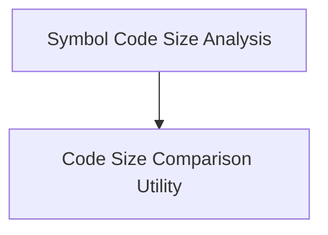

# Code Size Analysis Module

## Introduction

The `code_size_analysis` module provides tools for analyzing and comparing the size of code within binaries and object files. It helps developers monitor code bloat, identify areas for optimization, and track changes in code size over time.

## Architecture Overview

The module is composed of two primary sub-modules:

- **Symbol Code Size Analysis**: Focuses on detailed analysis of symbols within a single binary.
- **Code Size Comparison Utility**: Designed for comparing code sizes between different versions of files or builds.

These sub-modules work independently but collectively offer a comprehensive suite for managing and understanding code size.

<!-- DIAGRAM_JSON
{
    "direction": "TD",
    "nodes": [
        {"id": "symbol_analysis", "label": "Symbol Code Size Analysis", "type": "module", "link": "symbol_analysis.md"},
        {"id": "code_comparison", "label": "Code Size Comparison Utility", "type": "module", "link": "code_comparison.md"}
    ],
    "edges": [
        {"source": "symbol_analysis", "target": "code_comparison"}
    ],
    "groups": []
}
-->

## Sub-modules

### [Symbol Code Size Analysis](symbol_analysis.md)

This sub-module provides functionality to analyze the code size of symbols within a given binary. It supports categorizing symbols, grouping specializations, and listing symbols based on categories or showing uncategorized ones. This is particularly useful for detailed inspection of how different parts of the code contribute to the overall binary size.

### [Code Size Comparison Utility](code_comparison.md)

This utility is designed to compare code sizes between "new" and "old" versions of files, typically used to track code size changes between different builds. It supports various methods for specifying files, including patterns relative to build directories, direct file comparisons, and comparison of file lists. It can also list individual function sizes and output results in a parseable CSV format, aiding in automated analysis and reporting of code size regressions or improvements.
