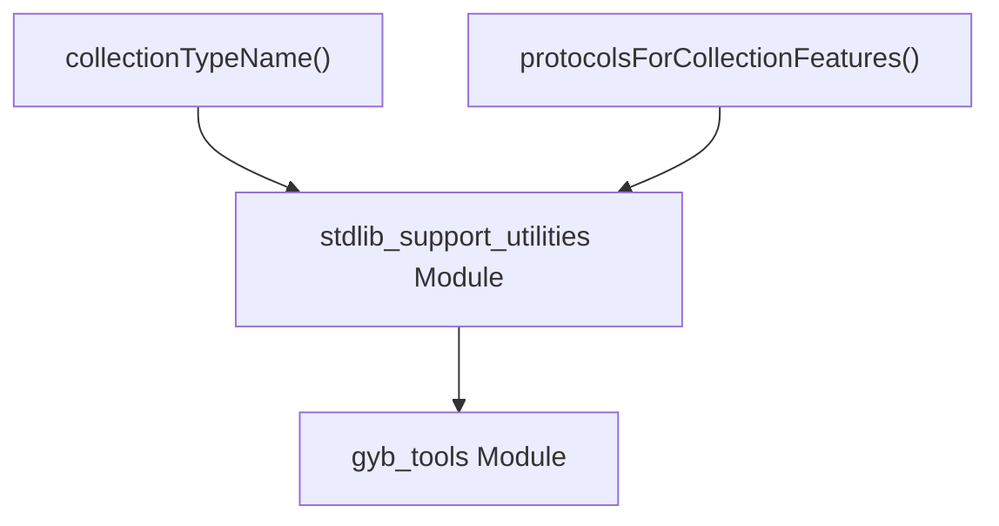

# collection_feature_utilities

The `collection_feature_utilities` module provides essential functions for generating standardized collection type names and their corresponding protocol lists within the `gyb_stdlib_support` context. These utilities are crucial for the GYB (Generate Your Boilerplate) process, ensuring consistent naming and protocol adherence for various collection types based on their features such as traversal, mutability, and range replaceability.

## Architecture and Component Relationships

This module primarily encapsulates two core functions that work in conjunction with the broader `stdlib_support_utilities` module, which is part of the `gyb_tools` ecosystem.

<!-- DIAGRAM_JSON
{
    "direction": "TD",
    "nodes": [
        {"id": "collection_type_name", "label": "collectionTypeName()", "type": "component", "link": null},
        {"id": "protocols_for_features", "label": "protocolsForCollectionFeatures()", "type": "component", "link": null},
        {"id": "stdlib_support", "label": "stdlib_support_utilities Module", "type": "external", "link": "stdlib_support_utilities.md"},
        {"id": "gyb_tools", "label": "gyb_tools Module", "type": "external", "link": "gyb_tools.md"}
    ],
    "edges": [
        {"source": "collection_type_name", "target": "stdlib_support"},
        {"source": "protocols_for_features", "target": "stdlib_support"},
        {"source": "stdlib_support", "target": "gyb_tools"}
    ],
    "groups": []
}
-->

### Core Components

#### `collectionTypeName(traversal, mutable, rangeReplaceable)`

This function constructs a descriptive name for a collection type based on its capabilities. It takes three boolean arguments:
- `traversal`: Indicates the collection's traversal capabilities (e.g., 'Collection', 'BidirectionalCollection', 'RandomAccessCollection').
- `mutable`: If `True`, prefixes the name with 'Mutable'.
- `rangeReplaceable`: If `True`, prefixes the name with 'RangeReplaceable'.

**Example:**
- `collectionTypeName(traversal='Collection', mutable=True, rangeReplaceable=False)` might return `'MutableCollection'`.
- `collectionTypeName(traversal='Collection', mutable=True, rangeReplaceable=True)` might return `'RangeReplaceableMutableCollection'`.

It internally uses the `collectionForTraversal` helper function (not detailed here) to determine the base collection name from the `traversal` argument.

#### `protocolsForCollectionFeatures(traversal, mutable, rangeReplaceable)`

This function returns a list of Swift protocol names that a collection type should conform to, based on its features. It also takes the same three boolean arguments as `collectionTypeName`.

**Example:**
- `protocolsForCollectionFeatures(traversal='Collection', mutable=True, rangeReplaceable=False)` might return `['Collection', 'MutableCollection']`.
- `protocolsForCollectionFeatures(traversal='Collection', mutable=True, rangeReplaceable=True)` might return `['Collection', 'MutableCollection', 'RangeReplaceableCollection']`.

Like `collectionTypeName`, this function also relies on the `collectionForTraversal` helper function to get the base collection protocol.

## How the Module Fits into the Overall System

The `collection_feature_utilities` module is a specialized part of the [stdlib_support_utilities](stdlib_support_utilities.md) module. Its functions are directly utilized during the generation of Swift Standard Library boilerplate code using the [gyb_tools](gyb_tools.md). By providing standardized naming and protocol lists, it ensures that generated collection types adhere to Swift's conventions and correctly implement the necessary interfaces, thus promoting consistency and reducing manual errors in the GYB-driven code generation process.
