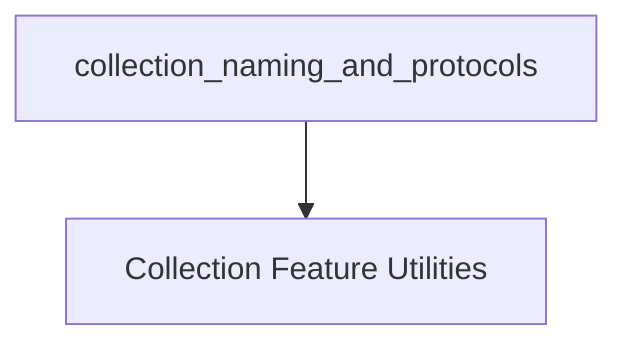

# collection_naming_and_protocols

## Introduction

The `collection_naming_and_protocols` module is a vital part of the `gyb_stdlib_support` utilities, specifically designed to assist in the generation of Swift standard library collection types. It provides core logic for dynamically determining appropriate collection type names and their conforming protocols based on features like traversal, mutability, and range-replaceability. This module is essential for the `GYB (Generate Your Boilerplate)` tools in maintaining consistent and feature-rich collection definitions across the Swift standard library.

## Architecture

This module's architecture is straightforward, focusing on a single utility sub-module that encapsulates the logic for naming and protocol generation.

<!-- DIAGRAM_JSON
{
    "direction": "TD",
    "nodes": [
        {"id": "collection_feature_utilities", "label": "Collection Feature Utilities", "type": "module", "link": "collection_feature_utilities.md"}
    ],
    "edges": [],
    "groups": []
}
-->

## Sub-modules

This module contains the following sub-module:

*   **[Collection Feature Utilities](collection_feature_utilities.md)**: Provides helper functions to generate collection type names and their corresponding protocols based on traversal, mutability, and range-replaceability features.

## How it fits into the overall system

The `collection_naming_and_protocols` module is a dependency of the `stdlib_support_utilities` which in turn is part of the broader `gyb_tools` module. It plays a crucial role in the build process of the Swift standard library by standardizing the naming and protocol conformance for various collection types. This ensures that generated code adheres to consistent patterns and correctly implements the required interfaces for different collection behaviors (e.g., `MutableCollection`, `RangeReplaceableCollection`).