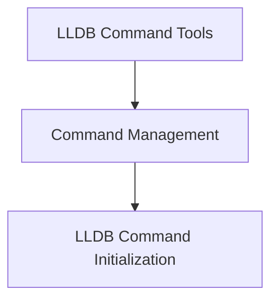

# Command Management Module

## Introduction

The `command_management` module is a crucial component within the `lldb_integration` system, specifically nested under the `lldb_command_tools` module. Its primary purpose is to manage and initialize custom commands for the LLDB (Low-Level Debugger) environment, thereby extending LLDB's native capabilities. This module enables developers to define and register specialized debugging commands, enhancing the interactive debugging experience by providing tailored functionalities.

## Architecture

The `command_management` module orchestrates the integration of custom LLDB commands. It directly encompasses the `lldb_command_initialization` sub-module, which is responsible for the actual registration and setup of these commands within the LLDB debugger session. This clear separation of concerns ensures a modular and maintainable structure for extending LLDB functionalities.

<!-- DIAGRAM_JSON
{
    "direction": "TD",
    "nodes": [
        {"id": "lldb_command_tools", "label": "LLDB Command Tools", "type": "module", "link": "lldb_command_tools.md"},
        {"id": "command_management", "label": "Command Management", "type": "module", "link": "command_management.md"},
        {"id": "lldb_command_initialization", "label": "LLDB Command Initialization", "type": "module", "link": "lldb_command_initialization.md"}
    ],
    "edges": [
        {"source": "lldb_command_tools", "target": "command_management"},
        {"source": "command_management", "target": "lldb_command_initialization"}
    ],
    "groups": []
}
-->

## Sub-modules

### LLDB Command Initialization

This sub-module, documented in [lldb_command_initialization.md](lldb_command_initialization.md), is responsible for setting up and registering custom commands within the LLDB debugger. It includes functionalities like `__lldb_init_module` for initializing the LLDB environment and `disassemble_to_file` for dumping assembly of a function or frame to a specified file. It consolidates the core logic for making these custom tools available and functional during debugging sessions.