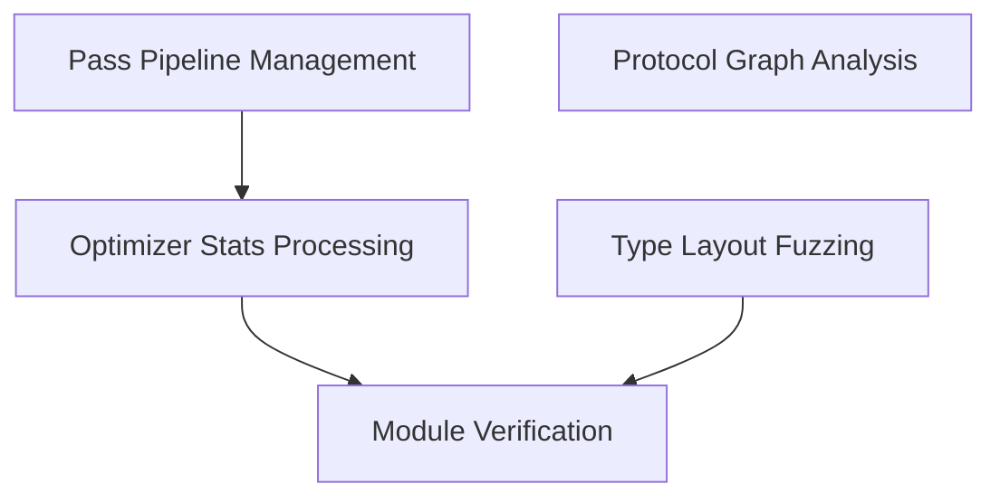

# Compiler Pass Analysis Module

The `compiler_pass_analysis` module provides a suite of tools for analyzing and optimizing Swift compiler passes. This includes utilities for processing compiler statistics, managing pass pipelines, verifying modules, analyzing protocol graphs, and fuzzing type layouts for robustness testing. It aims to help developers understand compiler behavior, identify performance bottlenecks, and ensure the correctness of compilation processes.

## Architecture

The module is structured into several sub-modules, each focusing on a specific aspect of compiler analysis. The following diagram illustrates the high-level relationships and dependencies between these components.

<!-- DIAGRAM_JSON
{
    "direction": "TD",
    "nodes": [
        {"id": "optimizer_stats_processing", "label": "Optimizer Stats Processing", "type": "module", "link": "optimizer_stats_processing.md"},
        {"id": "pass_pipeline_management", "label": "Pass Pipeline Management", "type": "module", "link": "pass_pipeline_management.md"},
        {"id": "protocol_graph_analysis", "label": "Protocol Graph Analysis", "type": "module", "link": "protocol_graph_analysis.md"},
        {"id": "module_verification", "label": "Module Verification", "type": "module", "link": "module_verification.md"},
        {"id": "type_layout_fuzzing", "label": "Type Layout Fuzzing", "type": "module", "link": "type_layout_fuzzing.md"}
    ],
    "edges": [
        {"source": "pass_pipeline_management", "target": "optimizer_stats_processing"},
        {"source": "optimizer_stats_processing", "target": "module_verification"},
        {"source": "type_layout_fuzzing", "target": "module_verification"}
    ],
    "groups": []
}
-->

## Sub-modules

### [Optimizer Stats Processing](optimizer_stats_processing.md)
This sub-module is responsible for collecting, processing, and comparing compiler optimizer counter data and statistics directories. It provides tools for analyzing compiler performance, identifying regressions, and generating various reports, including LNT-compatible output.

### [Pass Pipeline Management](pass_pipeline_management.md)
This sub-module defines and manages the various compiler pass pipelines. It allows for the configuration and execution of different optimization stages within the compiler, such as HighLevel, EarlyLoopOpt, MidLevelOpt, Lower, LowLevel, and LateLoopOpt.

### [Protocol Graph Analysis](protocol_graph_analysis.md)
This sub-module focuses on parsing Swift protocol definitions to build and analyze a graph representing their relationships and hierarchies. It helps in understanding the structure and dependencies of protocols within the Swift ecosystem.

### [Module Verification](module_verification.md)
This sub-module provides utilities for verifying the correctness and integrity of Swift modules. It leverages tools like `sil-opt` to perform verification checks on modules, supporting both modules from a build directory and those found within an Xcode installation.

### [Type Layout Fuzzing](type_layout_fuzzing.md)
This sub-module is designed for generating random Swift type layouts, including tuples, structs, enums, classes, and metatypes. It's primarily used for fuzzing and stress-testing the compiler's ability to handle complex and varied type structures.
