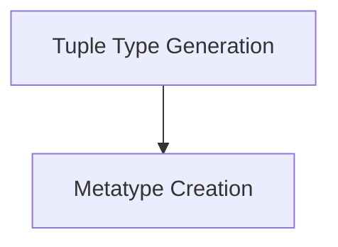

# Composite Type Constructs

## Introduction

The `composite_type_constructs` module, a part of the `type_layout_fuzzing` system, focuses on generating various composite types and type references for fuzzing purposes. It provides utilities for creating random tuple types and metatype references, essential for testing the compiler's handling of complex type layouts.

## Architecture

This module is composed of two primary sub-modules, each responsible for a specific aspect of composite type generation:

<!-- DIAGRAM_JSON
{
    "direction": "TD",
    "nodes": [
        {"id": "tuple_type_generation", "label": "Tuple Type Generation", "type": "module", "link": "tuple_type_generation.md"},
        {"id": "metatype_creation", "label": "Metatype Creation", "type": "module", "link": "metatype_creation.md"}
    ],
    "edges": [
        {"source": "tuple_type_generation", "target": "metatype_creation", "label": "Can interact with"}
    ],
    "groups": []
}
-->

## Sub-modules

### [Tuple Type Generation](tuple_type_generation.md)
This sub-module is responsible for generating random tuple types, which are crucial for testing how the compiler handles various combinations and nesting of types within tuples.

### [Metatype Creation](metatype_creation.md)
This sub-module focuses on creating metatype references, allowing the fuzzer to construct and evaluate expressions involving the `.Type` attribute, ensuring correct behavior for type metadata handling.
