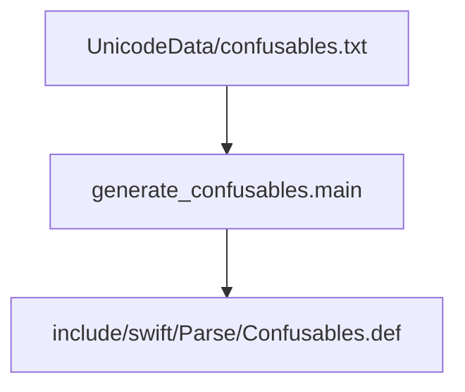

# confusable_generation

## Introduction
The `confusable_generation` module is responsible for processing Unicode confusable data and generating a definition file used by the Swift compiler. This file, `Confusables.def`, maps visually similar (confusable) Unicode characters to their canonical ASCII counterparts, primarily for punctuation characters. This mechanism helps the Swift parser identify and potentially flag or handle characters that could be used for "homograph attacks" or to obscure code readability.

## Architecture and Core Functionality
The `confusable_generation` module consists of a single core component, `main`, which orchestrates the entire generation process.

### `utils.generate_confusables.main`
This function is the entry point of the module. It performs the following steps:
1.  **Define Target Characters:** It initializes a list of common ASCII punctuation characters (e.g., `(`, `)`, `{`, `}`, `.`, `,`, etc.) for which confusable mappings are sought.
2.  **Read Confusables Data:** It reads the `UnicodeData/confusables.txt` file, which contains a comprehensive list of Unicode confusable mappings.
3.  **Parse and Filter:** It parses each line of `confusables.txt` using a regular expression to extract the confused character, its canonical equivalent, and their respective names. It then filters these mappings to only include those where the canonical equivalent is one of the predefined ASCII punctuation characters.
4.  **Generate Definition File:** It creates or overwrites the `include/swift/Parse/Confusables.def` file. This file contains a series of `CONFUSABLE` macro definitions, each mapping a confusable Unicode character (represented by its hexadecimal value and name) to its corresponding ASCII punctuation character (also by its hexadecimal value and name). Ad-hoc substitutions are applied for better clarity in names (e.g., "Solidus" becomes "Forward Slash").

The generated `Confusables.def` file is intended to be included and processed by the Swift compiler's parsing phase to enforce consistency and security related to character representation.

## Module Relationships

The `confusable_generation` module is a sub-module of `swift_code_utilities`, which itself is part of the broader `code_refactoring_and_linting` module.

The primary dependencies for this module are:
*   **Input Data:** `UnicodeData/confusables.txt` - This external file provides the raw Unicode confusable character data.
*   **Output Data:** `include/swift/Parse/Confusables.def` - This file is generated by the module and is consumed by the Swift parser.

<!-- DIAGRAM_JSON
{
    "direction": "TD",
    "nodes": [
        {"id": "main", "label": "generate_confusables.main", "type": "component", "link": null},
        {"id": "confusables_txt", "label": "UnicodeData/confusables.txt", "type": "external", "link": null},
        {"id": "confusables_def", "label": "include/swift/Parse/Confusables.def", "type": "external", "link": null}
    ],
    "edges": [
        {"source": "confusables_txt", "target": "main"},
        {"source": "main", "target": "confusables_def"}
    ],
    "groups": []
}
-->

