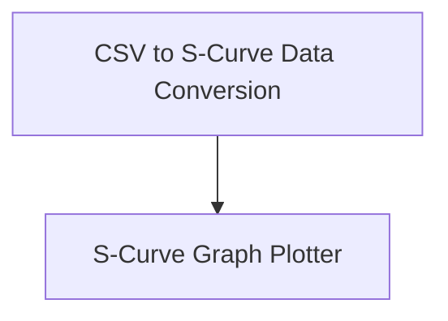

# Dev Scripts Module

## Introduction
The `dev_scripts` module provides a set of utilities designed to assist developers with data analysis and visualization, specifically focusing on generating and plotting s-curves from CSV data. These scripts are valuable for understanding performance changes and statistical distributions over a dataset.

## Architecture
The `dev_scripts` module is composed of two primary sub-modules: `csv_to_scurve` and `scurve_plotter`. These modules work in conjunction, where `csv_to_scurve` prepares data for `scurve_plotter` to visualize.

<!-- DIAGRAM_JSON
{
    "direction": "TD",
    "nodes": [
        {"id": "csv_to_scurve", "label": "CSV to S-Curve Data Conversion", "type": "module", "link": "csv_to_scurve.md"},
        {"id": "scurve_plotter", "label": "S-Curve Graph Plotter", "type": "module", "link": "scurve_plotter.md"}
    ],
    "edges": [
        {"source": "csv_to_scurve", "target": "scurve_plotter", "label": "Processes data for"}
    ],
    "groups": []
}
-->

## Sub-modules

### [CSV to S-Curve Data Conversion](csv_to_scurve.md)
This sub-module, powered by `utils.dev-scripts.csvcolumn_to_scurve.main`, is responsible for reading a CSV file, extracting specified 'before' and 'after' columns, and transforming this data into an s-curve format. The output is a new CSV file containing the percentage of total entries and the corresponding percentage change between the 'before' and 'after' values.

### [S-Curve Graph Plotter](scurve_plotter.md)
The `scurve_plotter` sub-module, primarily using `utils.dev-scripts.scurve_printer.main`, takes the s-curve formatted data (typically generated by `csv_to_scurve`) and generates a visual representation. It produces a detailed s-curve graph, allowing for extensive customization of titles, x and y-axis labels, and the range and frequency of tick marks, saving the output as an image file.