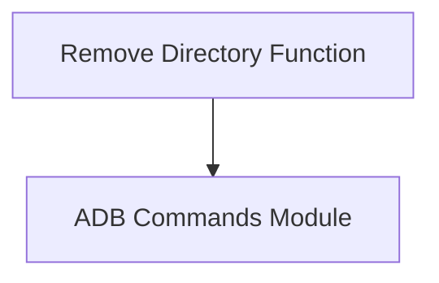

# device_file_management

The `device_file_management` module provides core functionality for managing files and directories on connected Android devices via ADB (Android Debug Bridge) commands. Specifically, it focuses on operations related to deleting files and directories on the device.

## Core Functionality

This module encapsulates the `rmdir` function, which allows for the recursive removal of files and directories on an Android device's filesystem.

### `rmdir`

The `rmdir` function is responsible for executing the `rm -rf` command on the specified path on the Android device. This is a powerful command that deletes all files and subdirectories within the given path.

**Path**: `utils.android.adb.commands.rmdir`

```python
def rmdir(path):
    """Remove all files in the device directory at `path`."""
    shell(['rm', '-rf', '{}/*'.format(path)])
```

**Description**:
This function takes a `path` argument, which represents the target directory on the Android device. It constructs an ADB `shell` command to recursively remove the contents of that directory.

## Architecture and Component Relationships

The `device_file_management` module is a specialized component within the larger `adb_commands` module, which itself is part of the `android_utilities` system. It directly utilizes lower-level ADB command execution capabilities provided by the `adb_commands` module to interact with the device.

<!-- DIAGRAM_JSON
{
    "direction": "TD",
    "nodes": [
        {"id": "rmdir_function", "label": "Remove Directory Function", "type": "component", "link": null},
        {"id": "adb_commands", "label": "ADB Commands Module", "type": "external", "link": "adb_commands.md"}
    ],
    "edges": [
        {"source": "rmdir_function", "target": "adb_commands"}
    ],
    "groups": []
}
-->



## How the Module Fits into the Overall System

The `device_file_management` module provides a focused capability for file system manipulation on Android devices. It is a leaf module that contributes to the broader `adb_commands` functionality, enabling higher-level modules within `android_utilities` (such as those responsible for pushing or testing products) to clean up device storage as needed. Its integration ensures reliable and automated management of temporary or outdated files on test devices.
