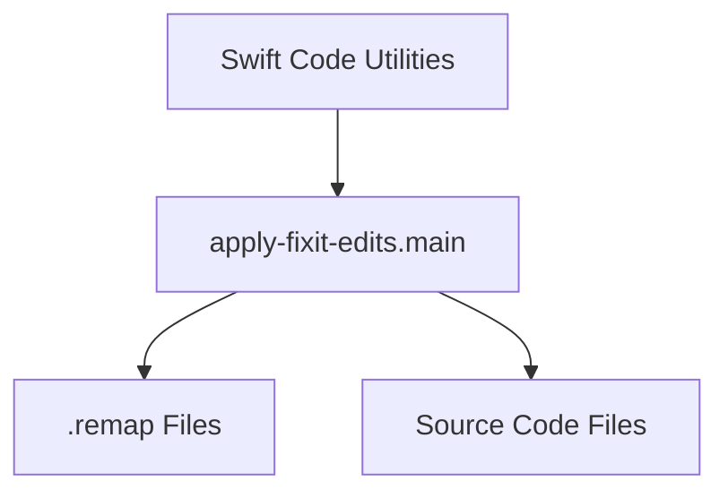

# fixit_application Module Documentation

## Introduction
The `fixit_application` module is responsible for applying automated "fix-it" edits to source code files. These edits are typically generated by tools like Swift compiler fix-its and are stored in `.remap` files. This module streamlines the process of integrating these suggested changes back into the codebase.

## Purpose and Core Functionality
The primary purpose of the `fixit_application` module is to read `.remap` files generated during the build or analysis process and apply the contained edits to the corresponding source files. This automates the resolution of certain warnings and errors, improving developer productivity and code consistency.

The core functionality is exposed through the `main` function:

### `utils.apply-fixit-edits.main`
```python
def main():
    parser = argparse.ArgumentParser(
        formatter_class=argparse.RawDescriptionHelpFormatter,
        description="""Finds all .remap files in a directory and applies their
edits to the source files.""")
    parser.add_argument("build_dir_path",
                        help="path to index info")

    args = parser.parse_args()
    return apply_edits(args.build_dir_path)
```
This function serves as the entry point for the module. It parses command-line arguments, expecting a `build_dir_path` which specifies the directory where `.remap` files are located. It then invokes an internal `apply_edits` function (not explicitly listed as a core component but an internal helper) to perform the actual file modifications.

## Architecture and Component Relationships

The `fixit_application` module is a leaf module within the `swift_code_utilities` module. It directly interacts with the file system to locate and process `.remap` files and modify source code.

<!-- DIAGRAM_JSON
{
    "direction": "TD",
    "nodes": [
        {"id": "main_function", "label": "apply-fixit-edits.main", "type": "component", "link": null},
        {"id": "remap_files", "label": ".remap Files", "type": "external", "link": null},
        {"id": "source_files", "label": "Source Code Files", "type": "external", "link": null},
        {"id": "swift_code_utilities", "label": "Swift Code Utilities", "type": "external", "link": "swift_code_utilities.md"}
    ],
    "edges": [
        {"source": "main_function", "target": "remap_files"},
        {"source": "main_function", "target": "source_files"},
        {"source": "swift_code_utilities", "target": "main_function"}
    ],
    "groups": []
}
-->


## How the Module Fits into the Overall System
The `fixit_application` module is a specialized tool within the larger [code_refactoring_and_linting](code_refactoring_and_linting.md) ecosystem, specifically nested under [swift_code_utilities](swift_code_utilities.md). It plays a crucial role in the automated maintenance and quality assurance of Swift codebases by providing a mechanism to efficiently apply compiler-suggested fixes. This helps in reducing technical debt and ensuring that the codebase adheres to desired standards without manual intervention for every small correction. Its operation is typically part of a larger build or continuous integration pipeline where fix-it suggestions are generated and then applied.
