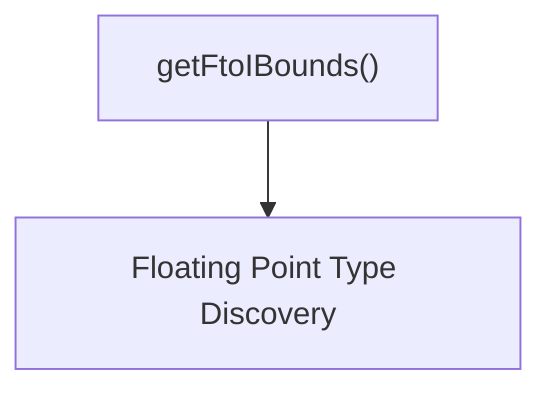

# floating_point_bounds_calculation

The `floating_point_bounds_calculation` module is a specialized component within the `swift_type_utilities` family, focusing on precisely determining the valid bounds for converting floating-point values to integer types in Swift. This module is crucial for ensuring the correctness and safety of type conversions, especially when dealing with potential overflow or underflow scenarios.

## Purpose and Core Functionality

This module's primary purpose is to provide the `getFtoIBounds` function, which calculates the minimum and maximum integer values that can be accurately represented when converting from a floating-point type with a given number of bits to an integer type with a specified number of bits and signedness.

### `getFtoIBounds(floatBits, intBits, signed)`

This function computes the inclusive lower and upper bounds for floating-point to integer conversions.

*   **`floatBits`**: The total number of bits used by the source floating-point type (e.g., 32 for `Float`, 64 for `Double`).
*   **`intBits`**: The total number of bits used by the target integer type (e.g., 8 for `Int8`, 32 for `Int32`).
*   **`signed`**: A boolean indicating whether the target integer type is signed (`True`) or unsigned (`False`).

**Function Logic:**
1.  **Floating-Point Type Identification**: It first determines the specific floating-point type (`floatTy`) based on `floatBits`, likely by consulting a mapping of bit counts to type properties. This step implicitly relies on the [floating_point_type_discovery](floating_point_type_discovery.md) module for information about floating-point characteristics.
2.  **Unsigned Integer Bounds**: If the target integer type is unsigned, the bounds are simply `(-1, 1 << intBits)`. The `-1` indicates that any negative floating-point value would convert to 0, and `1 << intBits` represents the first value beyond the maximum representable unsigned integer.
3.  **Signed Integer Bounds**: For signed integers, the calculation is more complex:
    *   `upper`: The maximum positive value for a signed integer is `(1 << (intBits - 1)) - 1`. However, the function uses `1 << (intBits - 1)`, which is the absolute value of the minimum negative number, and will be adjusted.
    *   **Small Integers (`intBits <= sigBits`)**: If the integer type has fewer or equal bits than the floating-point type's significand (mantissa) bits, the conversion range is largely determined by the integer's direct representational limits: `(-upper - 1, upper)`.
    *   **Large Integers (`intBits > sigBits`)**: When the integer type has more bits than the significand, the `ulp` (Unit in the Last Place) comes into play. The `ulp` is calculated as `1 << (intBits - sigBits)`. This `ulp` represents the precision limit of the floating-point number when it's scaled to the integer range. The bounds become `(-upper - ulp, upper)`. This accounts for the fact that floating-point numbers might not be able to precisely represent all large integers, leading to rounding and thus an extended range for conversion.

## Architecture and Component Relationships

The `floating_point_bounds_calculation` module is a leaf module that encapsulates the specific logic for determining conversion bounds. Its primary component, `getFtoIBounds`, interacts with data about floating-point types to perform its calculations.

<!-- DIAGRAM_JSON
{
    "direction": "TD",
    "nodes": [
        {"id": "get_f_to_i_bounds", "label": "getFtoIBounds()", "type": "component", "link": null},
        {"id": "floating_point_type_discovery_module", "label": "Floating Point Type Discovery", "type": "external", "link": "floating_point_type_discovery.md"}
    ],
    "edges": [
        {"source": "get_f_to_i_bounds", "target": "floating_point_type_discovery_module"}
    ],
    "groups": []
}
-->

### Relationships

*   **`getFtoIBounds`**: This is the core function of this module.
*   **Floating Point Type Discovery**: The `getFtoIBounds` function depends on information regarding floating-point types (e.g., `explicit_significand_bits`), which is provided or managed by the [floating_point_type_discovery](floating_point_type_discovery.md) module. This dependency ensures that the bounds calculation uses accurate characteristics of the floating-point types involved.

## How the Module Fits into the Overall System

The `floating_point_bounds_calculation` module is a critical sub-module of `floating_point_utilities`, which in turn is part of the larger `swift_type_utilities`. Its specialized function is essential for:

*   **Compiler/Runtime Type Conversion**: Providing accurate bounds for Swift's floating-point to integer conversion operations, helping to prevent silent data corruption or unexpected behavior.
*   **Static Analysis Tools**: Enabling tools to identify potential overflow/underflow issues during type conversions at compile time.
*   **Language Design/Specification**: Informing the behavior and guarantees of floating-point to integer conversions within the Swift language specification.

By centralizing this complex bound calculation, the module ensures consistency and correctness across all components that need to understand the valid range of these conversions.
