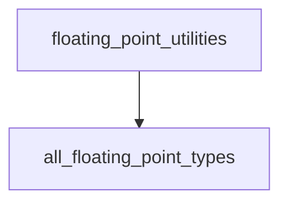

# Module: `floating_point_type_discovery`

## Introduction
The `floating_point_type_discovery` module is a specialized component within the `swift_type_utilities` system, focusing on identifying and providing a comprehensive list of all standard Swift floating-point types. This module serves as a foundational utility for tasks requiring iteration or specific handling of various floating-point data representations.

## Core Functionality and Purpose
This module's primary purpose is to expose a curated collection of Swift's floating-point types. Its core functionality is encapsulated in the `all_floating_point_types` function, which queries an internal mapping to retrieve all defined floating-point types. This ensures that any part of the system needing to work generically with floating-point types can easily obtain an exhaustive list.

### `all_floating_point_types`
- **Description**: This function is responsible for gathering and returning a collection of all recognized Swift floating-point types. It leverages an internal utility function, `floating_point_bits_to_type`, to construct this list.
- **Usage**: Provides a straightforward way to get a list of types such as `Float`, `Double`, `Float80`, etc., making it ideal for code generation, testing, or analysis tools that need to process or represent data across different floating-point precisions.

## Architecture and Component Relationships

The `floating_point_type_discovery` module is a leaf module within the `floating_point_utilities` submodule, which in turn is part of the broader `swift_type_utilities`. Its architecture is lean, centered around the `all_floating_point_types` function.

<!-- DIAGRAM_JSON
{
    "direction": "TD",
    "nodes": [
        {"id": "all_floating_point_types", "label": "all_floating_point_types", "type": "component", "link": null},
        {"id": "floating_point_utilities", "label": "floating_point_utilities", "type": "external", "link": "floating_point_utilities.md"}
    ],
    "edges": [
        {"source": "floating_point_utilities", "target": "all_floating_point_types"}
    ],
    "groups": []
}
-->

### Component Breakdown:
-   **`all_floating_point_types`**: The sole exposed core component of this module. It acts as the entry point for discovering floating-point types.
-   **Internal Utility (`floating_point_bits_to_type`)**: While not a separate module, the `all_floating_point_types` function internally relies on `floating_point_bits_to_type` (defined within the same `utils.SwiftFloatingPointTypes` file) to map bit representations to actual Swift floating-point type names. This helper function is crucial for the core component's operation.

## Integration with the Overall System
The `floating_point_type_discovery` module plays a supportive role within the `swift_type_utilities` ecosystem. It provides essential data (the list of floating-point types) that can be consumed by:

-   **Code Generation Tools**: For generating code that needs to operate on or test all floating-point types.
-   **Analysis Tools**: For static or dynamic analysis of Swift code, where understanding different floating-point representations is necessary.
-   **Testing Frameworks**: To ensure comprehensive test coverage for functions or operations involving various floating-point precisions.

This module abstracts away the specifics of how floating-point types are enumerated, offering a consistent and reliable API for other modules, especially its parent module, [floating_point_utilities](floating_point_utilities.md).
