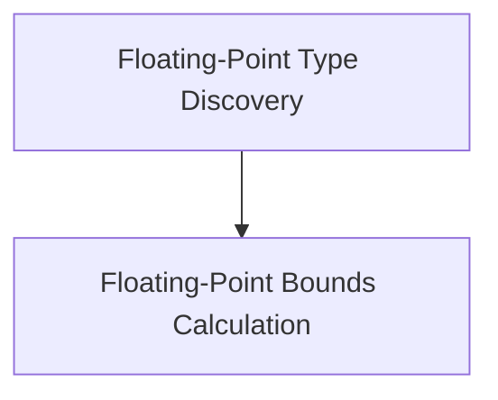

# Floating Point Utilities

## Introduction

The `floating_point_utilities` module provides essential functions for working with Swift's floating-point types. It is a sub-module of the larger [swift_type_utilities](swift_type_utilities.md) module, focusing specifically on operations and information related to floating-point representations and conversions.

## Architecture

This module is composed of two primary sub-modules, each handling a distinct aspect of floating-point utility: calculating conversion bounds and discovering available floating-point types.

<!-- DIAGRAM_JSON
{
    "direction": "TD",
    "nodes": [
        {"id": "floating_point_bounds_calculation", "label": "Floating-Point Bounds Calculation", "type": "module", "link": "floating_point_bounds_calculation.md"},
        {"id": "floating_point_type_discovery", "label": "Floating-Point Type Discovery", "type": "module", "link": "floating_point_type_discovery.md"}
    ],
    "edges": [
        {"source": "floating_point_type_discovery", "target": "floating_point_bounds_calculation"}
    ],
    "groups": []
}
-->

## Sub-modules

### [Floating-Point Type Discovery](floating_point_type_discovery.md)
This sub-module is responsible for identifying and listing all available floating-point types supported within the Swift environment. It simplifies the process of querying and iterating over these types, which is crucial for generic programming and type-agnostic operations.

### [Floating-Point Bounds Calculation](floating_point_bounds_calculation.md)
This sub-module provides utilities for determining the valid range of integer values that can be represented when converting from a floating-point type. It considers the bit-width of both the source floating-point type and the target integer type, as well as whether the integer type is signed or unsigned, to accurately define conversion boundaries.