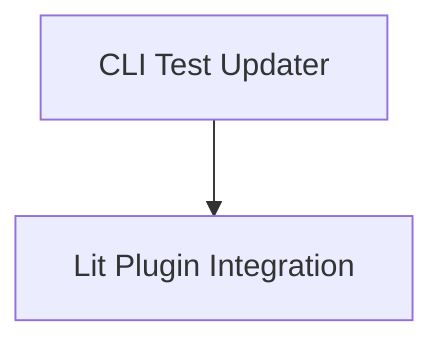

# generated_test_updater Module Documentation

## Introduction
The `generated_test_updater` module provides utilities for automatically updating generated test files within a project. It offers both a standalone command-line interface and an integration with the Lit testing framework to ensure that tests reflecting generated code remain up-to-date with minimal manual intervention.

## Architecture Overview
The `generated_test_updater` module is composed of two main sub-modules:
- **CLI Updater**: Handles direct command-line execution for updating test files.
- **Lit Plugin Integration**: Provides seamless integration with the Lit testing framework for automated test updates during test runs.

<!-- DIAGRAM_JSON
{
    "direction": "TD",
    "nodes": [
        {"id": "cli_updater", "label": "CLI Test Updater", "type": "module", "link": "cli_updater.md"},
        {"id": "lit_plugin_integration", "label": "Lit Plugin Integration", "type": "module", "link": "lit_plugin_integration.md"}
    ],
    "edges": [
        {"source": "cli_updater", "target": "lit_plugin_integration"}
    ],
    "groups": []
}
-->

## Sub-modules

### [CLI Test Updater](cli_updater.md)
This sub-module provides the main command-line utility (`utils.update-generated-tests.main`) for updating generated test files. It allows users to specify a test file and apply string substitutions to the GENERATED-BY command within the file.

### [Lit Plugin Integration](lit_plugin_integration.md)
This sub-module integrates the test updating functionality directly into the Lit testing framework through `utils.update_generated_tests.litplugin.generate_test_lit_plugin`. It enables automated updates of generated tests as part of the `lit` test suite execution, leveraging Lit's internal mechanisms for temporary paths and substitutions.

## How it Fits into the Overall System
The `generated_test_updater` module is a crucial part of the `test_generation_and_update` system, specifically focusing on maintaining the currency of generated tests. It ensures that tests derived from code generation processes accurately reflect the current state of the code, preventing stale tests and reducing maintenance overhead. It works in conjunction with other test utilities within the broader `utils` directory to provide a robust testing infrastructure.

