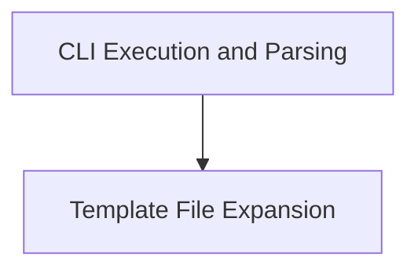

# gyb_cli_interface Module Documentation

## Introduction

The `gyb_cli_interface` module provides the command-line interface for the GYB (Generate Your Boilerplate) tool. It enables users to parse template files, define bindings, and generate output based on Python expressions embedded within the templates. This module serves as the primary entry point for interacting with GYB from the command line.

## Architecture Overview

The `gyb_cli_interface` module is composed of two main sub-modules:
- `cli_execution`: Handles the overall command-line parsing and execution flow.
- `template_expansion`: Manages the core logic for expanding GYB template files.

These sub-modules work together to provide a seamless template generation experience.

<!-- DIAGRAM_JSON
{
    "direction": "TD",
    "nodes": [
        {"id": "cli_execution", "label": "CLI Execution and Parsing", "type": "module", "link": "cli_execution.md"},
        {"id": "template_expansion", "label": "Template File Expansion", "type": "module", "link": "template_expansion.md"}
    ],
    "edges": [
        {"source": "cli_execution", "target": "template_expansion"}
    ],
    "groups": []
}
-->

## Sub-modules

### CLI Execution and Parsing (`cli_execution`)

This sub-module, primarily through `utils.gyb.main`, is responsible for:
- Parsing command-line arguments, including input file, output file, defines, and various options.
- Setting up the execution context for the template.
- Orchestrating the parsing and execution of the GYB template.

For more details, refer to the [CLI Execution and Parsing Documentation](cli_execution.md).

### Template File Expansion (`template_expansion`)

This sub-module, primarily through `utils.gyb.expand`, focuses on:
- Reading and parsing the content of a GYB template file.
- Executing the template with provided local bindings.
- Applying line directives for accurate source location information.

For more details, refer to the [Template File Expansion Documentation](template_expansion.md).
