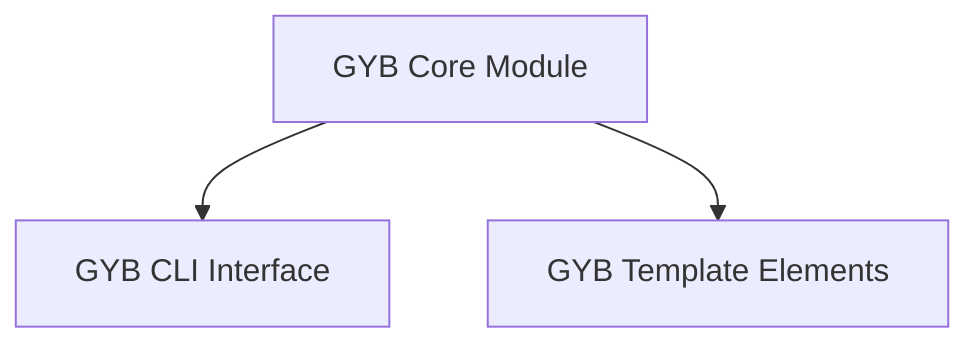

# GYB Core Module

The `gyb_core` module is the heart of the "Generate Your Boilerplate" (GYB) tool. It provides the core functionality for parsing GYB templates, executing embedded Python code, and generating output text. This module is essential for automated code generation, allowing developers to create dynamic content based on Python logic embedded within text files.

## Architecture Overview

The `gyb_core` module is structured into two main sub-modules: `gyb_cli_interface` and `gyb_template_elements`. The `gyb_cli_interface` handles the interaction with the command-line, managing template expansion and file operations. The `gyb_template_elements` sub-module defines the fundamental building blocks for representing and executing different parts of a GYB template, such as Python code blocks and literal text.

<!-- DIAGRAM_JSON
{
    "direction": "TD",
    "nodes": [
        {"id": "gyb_core", "label": "GYB Core Module", "type": "module"},
        {"id": "gyb_cli_interface", "label": "GYB CLI Interface", "type": "module", "link": "gyb_cli_interface.md"},
        {"id": "gyb_template_elements", "label": "GYB Template Elements", "type": "module", "link": "gyb_template_elements.md"}
    ],
    "edges": [
        {"source": "gyb_core", "target": "gyb_cli_interface"},
        {"source": "gyb_core", "target": "gyb_template_elements"}
    ],
    "groups": []
}
-->

## Sub-modules

### [GYB CLI Interface](gyb_cli_interface.md)
This sub-module is responsible for the command-line interaction of the GYB tool. It encompasses the main entry point (`utils.gyb.main`) for parsing arguments, reading template files, executing them, and writing output. It also includes the `utils.gyb.expand` function, which provides a programmatic way to expand a GYB template file.

### [GYB Template Elements](gyb_template_elements.md)
This sub-module defines the fundamental components that make up a GYB template's Abstract Syntax Tree (AST). It includes the `utils.gyb.Code` component, which handles the compilation and execution of Python code embedded within templates, and the `utils.gyb.Literal` component, which represents and processes literal text segments in the template.
