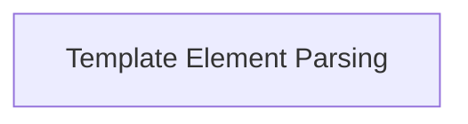

# gyb_template_elements Module Documentation

## Introduction
The `gyb_template_elements` module, part of the broader `gyb_core` within the `gyb_tools` suite, is responsible for processing the fundamental building blocks of GYB (Generate Your Boilerplate) templates. It defines the core AST nodes for handling both literal text and embedded Python code, enabling dynamic content generation.

## Architecture Overview
This module defines the basic elements that the GYB parser recognizes and processes during template expansion. It provides two primary AST nodes: `Code` for executing Python logic and `Literal` for rendering static text. These elements are sequentially processed to construct the final output. The `gyb_template_elements` module forms a critical part of the GYB template engine, directly influencing how templates are interpreted and expanded.

<!-- DIAGRAM_JSON
{
    "direction": "TD",
    "nodes": [
        {"id": "template_element_parsing", "label": "Template Element Parsing", "type": "module", "link": "template_element_parsing.md"}
    ],
    "edges": [],
    "groups": []
}
-->

## Sub-modules

### [Template Element Parsing](template_element_parsing.md)
This sub-module focuses on the core components for parsing and processing individual elements within GYB templates. It encompasses the handling of both executable Python code blocks and plain literal text, forming the fundamental logic for template expansion.
