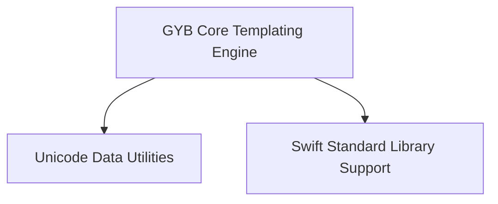

# GYB Tools Module Documentation

## Introduction and Purpose

The `gyb_tools` module provides a powerful boilerplate generation system (GYB - Generate Your Boilerplate!) designed to simplify the creation of repetitive code. It leverages Python-like syntax within template files to dynamically generate output, making it highly versatile for tasks such as generating Swift standard library code, handling Unicode data, and various other code generation needs. This module is essential for maintaining consistency and reducing manual effort in codebases that require extensive boilerplate.

## Architecture Overview

The `gyb_tools` module is structured into several key sub-modules, each responsible for a specific aspect of its functionality. The core templating engine processes template files, while dedicated utilities handle Unicode data and provide support for Swift Standard Library conventions.

<!-- DIAGRAM_JSON
{
    "direction": "TD",
    "nodes": [
        {"id": "gyb_core", "label": "GYB Core Templating Engine", "type": "module", "link": "gyb_core.md"},
        {"id": "unicode_data_utilities", "label": "Unicode Data Utilities", "type": "module", "link": "unicode_data_utilities.md"},
        {"id": "stdlib_support_utilities", "label": "Swift Standard Library Support", "type": "module", "link": "stdlib_support_utilities.md"}
    ],
    "edges": [
        {"source": "gyb_core", "target": "unicode_data_utilities"},
        {"source": "gyb_core", "target": "stdlib_support_utilities"}
    ],
    "groups": []
}
-->

## High-Level Functionality

The `gyb_tools` module comprises the following sub-modules:

*   **[GYB Core Templating Engine](gyb_core.md)**: This sub-module contains the fundamental logic for the GYB templating system. It includes the main entry point for executing GYB, functions for expanding templates programmatically, and the AST nodes (Code and Literal) that represent the parsed structure of a template. It is responsible for interpreting Python expressions and code blocks within templates to generate the final output.

*   **[Unicode Data Utilities](unicode_data_utilities.md)**: This utility sub-module is designed to handle Unicode character properties, specifically the Grapheme Cluster Break Property. It allows for the loading and lookup of Unicode character data, which can be crucial for correctly processing and rendering text in various languages.

*   **[Swift Standard Library Support](stdlib_support_utilities.md)**: This sub-module provides helper functions that facilitate the generation of Swift code related to collection types in the Swift Standard Library. It includes utilities to determine appropriate collection type names and protocols based on desired features like mutability and range replaceability, commonly used within GYB templates to create Swift-specific boilerplate.
