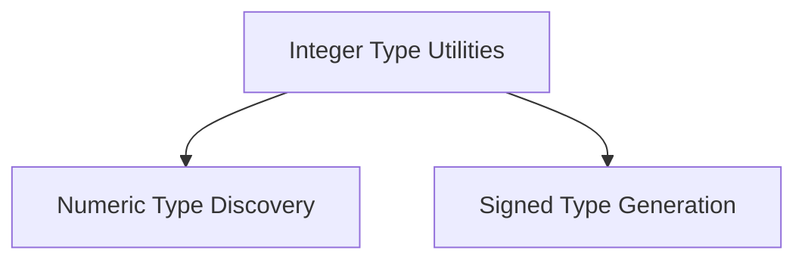

# integer_type_utilities Module Documentation

## Introduction
This module provides utility functions specifically designed for working with Swift integer types. It facilitates the discovery of all numeric type names and the generation of various signed integer type configurations, playing a crucial role in Swift's type system introspection and code generation.

## Architecture Overview
The `integer_type_utilities` module is a sub-module of `swift_type_utilities`, which centralizes functionalities related to Swift's numeric types. It is logically divided into two primary sub-modules: `numeric_type_discovery` and `signed_type_generation`. These sub-modules encapsulate distinct but related aspects of integer type manipulation.

<!-- DIAGRAM_JSON
{
    "direction": "TD",
    "nodes": [
        {"id": "integer_type_utilities", "label": "Integer Type Utilities", "type": "module"},
        {"id": "numeric_type_discovery", "label": "Numeric Type Discovery", "type": "module", "link": "numeric_type_discovery.md"},
        {"id": "signed_type_generation", "label": "Signed Type Generation", "type": "module", "link": "signed_type_generation.md"}
    ],
    "edges": [
        {"source": "integer_type_utilities", "target": "numeric_type_discovery"},
        {"source": "integer_type_utilities", "target": "signed_type_generation"}
    ],
    "groups": []
}
-->

## Sub-module Functionality:

*   **[Numeric Type Discovery](numeric_type_discovery.md)**: This sub-module focuses on identifying and listing all available numeric type names within the Swift type system. It consolidates names from both integer and real number types to provide a comprehensive list.

*   **[Signed Type Generation](signed_type_generation.md)**: This sub-module is responsible for generating definitions for various signed Swift integer types. It iterates through different bitwidths to create `SwiftIntegerType` instances, including special handling for word-sized integers.

## Relationship to other modules:
The `integer_type_utilities` module is a specialized component of the broader [swift_type_utilities](swift_type_utilities.md) module. It works in conjunction with its sibling module, [floating_point_utilities](floating_point_utilities.md), to provide a complete set of tools for managing Swift's numeric types.
