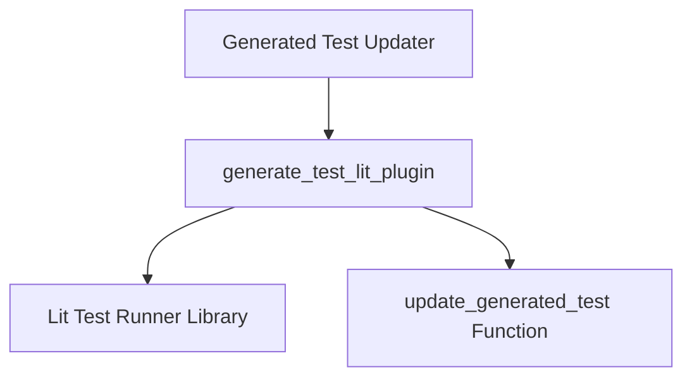

# lit_plugin_integration Module Documentation

## Introduction

The `lit_plugin_integration` module provides the core functionality for integrating with the `lit` test runner to generate and update tests. It acts as a plugin for `lit`, allowing automated test generation and modification based on specific criteria.

## Architecture and Component Relationships

This module primarily exposes the `generate_test_lit_plugin` function, which serves as an entry point for `lit` to interact with the test generation logic. It leverages `lit`'s internal utilities for test path and substitution management and orchestrates the actual test update process by calling an internal helper function.

<!-- DIAGRAM_JSON
{
    "direction": "TD",
    "nodes": [
        {"id": "generated_test_updater", "label": "Generated Test Updater", "type": "external", "link": "generated_test_updater.md"},
        {"id": "generate_test_lit_plugin", "label": "generate_test_lit_plugin", "type": "component", "link": null},
        {"id": "update_generated_test_func", "label": "update_generated_test Function", "type": "component", "link": null},
        {"id": "lit_library", "label": "Lit Test Runner Library", "type": "external", "link": null}
    ],
    "edges": [
        {"source": "generated_test_updater", "target": "generate_test_lit_plugin"},
        {"source": "generate_test_lit_plugin", "target": "lit_library"},
        {"source": "generate_test_lit_plugin", "target": "update_generated_test_func"}
    ],
    "groups": []
}
-->

## Core Functionality

### `generate_test_lit_plugin(result, test, commands)`

This function is designed to be called as a `lit` plugin. It takes the test `result`, the `test` object itself, and `commands` as input. Its primary responsibilities include:

1.  **Obtaining Temporary Paths and Substitutions:** It uses `lit.TestRunner.getTempPaths` and `lit.TestRunner.getDefaultSubstitutions` to set up the necessary environment for the test.
2.  **Updating Generated Tests:** It invokes an internal `update_generated_test` function, passing the test file path and the `lit` substitutions. This `update_generated_test` function (not directly part of this module's core components but called by its main function) is responsible for the actual logic of modifying or creating the test file content.
3.  **Error Handling:** It captures and returns any error messages or results from the `update_generated_test` process.

## Integration with the Overall System

The `lit_plugin_integration` module is a crucial part of the larger [test_generation_and_update](test_generation_and_update.md) system, specifically residing under the [generated_test_updater](generated_test_updater.md) module. It provides the `lit` test runner with the necessary hooks to automatically manage and update generated test files. This ensures that tests remain synchronized with any underlying code changes that necessitate updates to their expected outputs or structure.