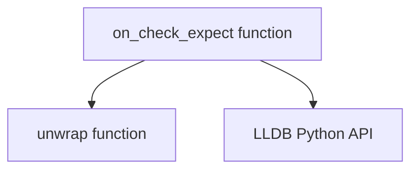

# `lldb_check_expect` Module Documentation

## Introduction

The `lldb_check_expect` module provides a crucial utility for automated assertion and validation within LLDB debugging sessions. It allows developers to define expected outcomes for variables or expressions at specific points in their code, facilitating automated testing and reducing manual inspection during debugging.

## Purpose and Core Functionality

The primary purpose of this module is to enable "check-expect" functionality in LLDB. When a breakpoint configured with `on_check_expect` is hit, the module evaluates a specified expression in the context of the calling frame and compares its actual value against an expected value. If the values match, execution continues without interruption. If a discrepancy is found, the debugger is instructed to stop, and detailed information about the mismatch is printed.

This automates the process of verifying program state, making it invaluable for regression testing, bug reproduction, and ensuring correctness of complex data transformations within a debugging environment.

### Core Components

#### `on_check_expect(frame, bp_loc, session)`

This function is the central entry point for the check-expect mechanism. It is designed to be invoked as an LLDB breakpoint command or callback. Upon invocation, it performs the following steps:

1.  **Identify Parent Frame:** Determines the calling frame (the frame where the `check-expect` assertion was originally made).
2.  **Extract Arguments:** Retrieves the `wrapped_var_name` and `wrapped_expected_value` arguments, which represent the variable/expression to check and its expected value, respectively. These are then "unwrapped" using an internal helper function.
3.  **Evaluate Expression:** Switches to the parent frame and evaluates the `var_name` (the expression to be checked) to obtain its actual runtime value.
4.  **Compare Values:** Compares the `eval_result` (actual value) with the `expected_value`.
5.  **Decision and Output:**
    *   If `eval_result == expected_value`, the function returns `False`, allowing execution to continue.
    *   If a mismatch occurs, it prints diagnostic information, including the expected and actual values, and highlights the first character difference. It then returns `True`, signaling LLDB to stop execution.

## Architecture and Component Relationships

The `lldb_check_expect` module is a leaf module within the `lldb_integration` family. It depends on the core LLDB Python API for interacting with the debugger's state (frames, variables, breakpoints).

<!-- DIAGRAM_JSON
{
    "direction": "TD",
    "nodes": [
        {"id": "on_check_expect", "label": "on_check_expect function", "type": "component", "link": null},
        {"id": "unwrap_func", "label": "unwrap function", "type": "component", "link": null},
        {"id": "lldb_api", "label": "LLDB Python API", "type": "external", "link": "lldb_integration.md"}
    ],
    "edges": [
        {"source": "on_check_expect", "target": "unwrap_func"},
        {"source": "on_check_expect", "target": "lldb_api"}
    ],
    "groups": []
}
-->

## How the Module Fits into the Overall System

The `lldb_check_expect` module is an integral part of the larger [lldb_integration](lldb_integration.md) system, which provides a suite of tools and utilities for enhancing the LLDB debugging experience. Specifically, `lldb_check_expect` provides the assertion capabilities that complement other LLDB-related modules, such as those for command management or data formatters. It enables a programmatic approach to debugging verification, reducing the reliance on manual observation and facilitating more robust automated testing workflows for compiler and runtime development.
