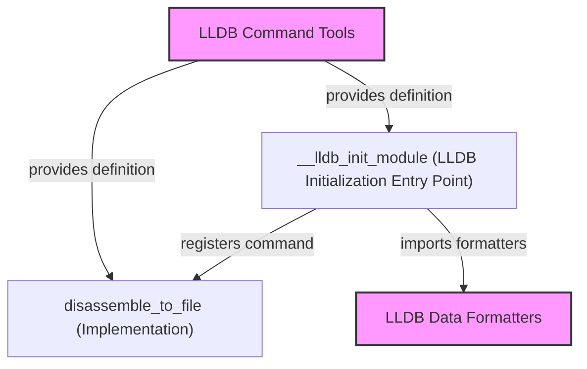

# LLDB Command Initialization Module

This module, `lldb_command_initialization`, is responsible for setting up and initializing custom commands within the LLDB debugger environment. It serves as an entry point for integrating custom functionalities into LLDB, particularly those defined in the `lldb_command_tools` module.

## Core Functionality

The `lldb_command_initialization` module focuses on two key aspects:

1.  **LLDB Module Initialization (`__lldb_init_module`)**: This function is the primary entry point for LLDB to load and initialize this module. It handles:
    *   Importing LLVM and Swift data formatters, which are crucial for displaying complex data structures in a human-readable format within LLDB. These formatters are provided by the [lldb_data_formatters.md](lldb_data_formatters.md) module.
    *   Registering several custom LLDB commands, including `disassemble-asm-cfg`, `disassemble-to-file`, and `sequence`. These commands extend LLDB's capabilities, offering advanced debugging utilities to the user.

2.  **Disassemble to File (`disassemble_to_file`)**: This function implements the `disassemble-to-file` LLDB command. It allows users to:
    *   Dump the assembly disassembly of the current execution frame directly into a specified file.
    *   Optionally, disassemble a specific function by name and save its assembly output to a file. This is particularly useful for in-depth analysis of compiled code.

## Architecture and Component Relationships

The `lldb_command_initialization` module acts as a configuration and setup layer for LLDB custom commands. Its primary components and their relationships are illustrated below:

<!-- DIAGRAM_JSON
{
    "direction": "TD",
    "nodes": [
        {"id": "lldb_init_module_entry", "label": "__lldb_init_module (LLDB Initialization Entry Point)", "type": "component", "link": null},
        {"id": "disassemble_to_file_impl", "label": "disassemble_to_file (Implementation)", "type": "component", "link": null},
        {"id": "lldb_data_formatters", "label": "LLDB Data Formatters", "type": "external", "link": "lldb_data_formatters.md"},
        {"id": "lldb_command_tools", "label": "LLDB Command Tools", "type": "external", "link": "lldb_command_tools.md"}
    ],
    "edges": [
        {"source": "lldb_init_module_entry", "target": "disassemble_to_file_impl", "label": "registers command"},
        {"source": "lldb_init_module_entry", "target": "lldb_data_formatters", "label": "imports formatters"},
        {"source": "lldb_command_tools", "target": "lldb_init_module_entry", "label": "provides definition"},
        {"source": "lldb_command_tools", "target": "disassemble_to_file_impl", "label": "provides definition"}
    ],
    "groups": []
}
-->

## How the Module Fits into the Overall System

The `lldb_command_initialization` module is a crucial part of the larger [lldb_integration.md](lldb_integration.md) system. It specifically resides within the [command_management.md](command_management.md) and [lldb_command_tools.md](lldb_command_tools.md) hierarchies. Its primary role is to ensure that all necessary custom LLDB commands and data formatters are properly loaded and accessible when an LLDB session starts.

By centralizing the initialization logic, this module ensures that LLDB is configured with an extended set of powerful debugging tools, making the overall debugging experience more efficient and effective for developers working with specific codebases that leverage these custom commands.
