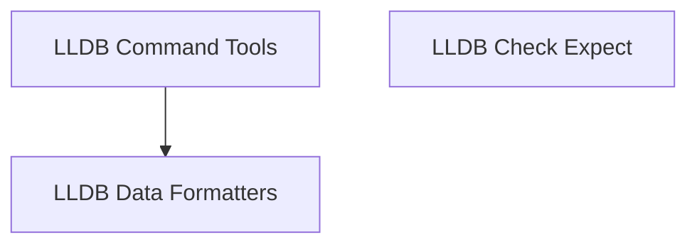

# LLDB Integration Module

## Introduction and Purpose

The `lldb_integration` module provides a suite of utilities and custom commands to enhance the LLDB (Low-Level Debugger) experience, particularly for Swift and system-level debugging. It focuses on extending LLDB's capabilities for assertion checking, custom command execution, and improved data visualization.

## Architecture Overview

The `lldb_integration` module is structured into several sub-modules, each addressing a specific aspect of LLDB extension. These sub-modules work cohesively to provide a richer debugging environment.

<!-- DIAGRAM_JSON
{
    "direction": "TD",
    "nodes": [
        {"id": "lldb_command_tools", "label": "LLDB Command Tools", "type": "module", "link": "lldb_command_tools.md"},
        {"id": "lldb_data_formatters", "label": "LLDB Data Formatters", "type": "module", "link": "lldb_data_formatters.md"},
        {"id": "lldb_check_expect", "label": "LLDB Check Expect", "type": "module", "link": "lldb_check_expect.md"}
    ],
    "edges": [
        {"source": "lldb_command_tools", "target": "lldb_data_formatters"}
    ],
    "groups": []
}
-->

## Sub-modules

### [LLDB Command Tools](lldb_command_tools.md)
This sub-module provides core utilities for initializing the LLDB module and adding custom commands for code disassembly. It includes the `__lldb_init_module` function, which is crucial for setting up the debugging environment, and `disassemble_to_file` for dumping assembly to a specified file.

### [LLDB Data Formatters](lldb_data_formatters.md)
This sub-module manages custom data formatters to enhance the display of complex data types, such as demangled Swift nodes, within LLDB. The `DemangleNodeSummaryProvider` component is a key part of this, improving the readability of Swift variables.

### [LLDB Check Expect](lldb_check_expect.md)
This sub-module offers a utility for performing assertion-like checks during LLDB debugging sessions, comparing evaluated expressions against expected values. The `on_check_expect` function allows developers to validate states and values without interrupting the debugging flow unless a mismatch occurs.
