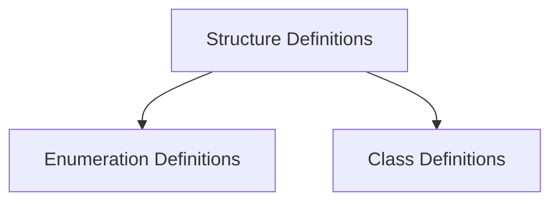

# Nominal Type Definitions Module

## Introduction
The `nominal_type_definitions` module is a core component of the type layout fuzzer, specifically designed for generating various nominal type declarations in a fuzzed context. This module plays a crucial role in creating diverse and complex type structures for testing compilers and language runtimes, ensuring robust error handling and optimization.

## Architecture
This module is structured around the distinct categories of nominal types it supports: structures, enumerations, and classes. Each category is handled by a dedicated sub-module, ensuring clear separation of concerns and maintainability. These sub-modules define the syntax and structure for their respective types, contributing to the overall type fuzzer's ability to generate valid yet challenging code.

<!-- DIAGRAM_JSON
{
    "direction": "TD",
    "nodes": [
        {"id": "struct_definitions", "label": "Structure Definitions", "type": "module", "link": "struct_definitions.md"},
        {"id": "enum_definitions", "label": "Enumeration Definitions", "type": "module", "link": "enum_definitions.md"},
        {"id": "class_definitions", "label": "Class Definitions", "type": "module", "link": "class_definitions.md"}
    ],
    "edges": [
        {"source": "struct_definitions", "target": "enum_definitions"},
        {"source": "struct_definitions", "target": "class_definitions"}
    ],
    "groups": []
}
-->

## Sub-modules

### [Structure Definitions](struct_definitions.md)
This sub-module focuses on the programmatic generation of `struct` declarations, including their fields, within the fuzzer's context.

### [Enumeration Definitions](enum_definitions.md)
This sub-module is responsible for creating `enum` declarations, defining their cases and associated types for fuzzed code generation.

### [Class Definitions](class_definitions.md)
This sub-module handles the generation of `class` declarations, contributing to the creation of complex object hierarchies in the fuzzed input.