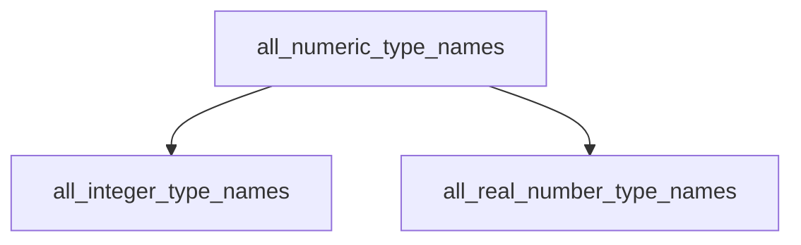

# `numeric_type_discovery` Module Documentation

## Introduction

The `numeric_type_discovery` module is responsible for identifying and consolidating the names of all numeric types available in Swift. It serves as a central point for discovering both integer and floating-point type names, crucial for various compiler and tooling utilities that require comprehensive type information.

## Purpose and Core Functionality

This module's primary purpose is to provide a unified list of all numeric type names in Swift. It achieves this by combining lists of integer types and real number (floating-point) types from their respective utility modules. This aggregation simplifies type discovery for downstream processes, ensuring that tools can access a complete set of numeric types without needing to query different sub-modules individually.

The core functionality is encapsulated in a single function that orchestrates the collection and concatenation of these type lists.

## Architecture and Component Relationships

The `numeric_type_discovery` module is a leaf module within the `swift_type_utilities` hierarchy. It depends on `integer_type_utilities` for integer type names and `floating_point_utilities` for real number type names. It acts as an aggregator, providing a consolidated view of numeric types.

<!-- DIAGRAM_JSON
{
    "direction": "TD",
    "nodes": [
        {"id": "all_numeric_type_names", "label": "all_numeric_type_names", "type": "component", "link": null},
        {"id": "all_integer_type_names", "label": "all_integer_type_names", "type": "external", "link": "integer_type_utilities.md"},
        {"id": "all_real_number_type_names", "label": "all_real_number_type_names", "type": "external", "link": "floating_point_utilities.md"}
    ],
    "edges": [
        {"source": "all_numeric_type_names", "target": "all_integer_type_names"},
        {"source": "all_numeric_type_names", "target": "all_real_number_type_names"}
    ],
    "groups": []
}
-->



## How the Module Fits into the Overall System

The `numeric_type_discovery` module plays a vital role in the Swift ecosystem by providing a definitive list of all numeric types. This consolidated list is essential for:

*   **Compiler Infrastructure**: Enabling the Swift compiler to correctly identify and process all supported numeric types during compilation, type checking, and code generation.
*   **Tooling**: Assisting development tools (like debuggers, linters, or IDEs) in understanding the full range of numeric types for features such as autocompletion, type inference, and static analysis.
*   **Analysis and Benchmarking**: Providing a consistent and complete set of types for performance analysis, bug reduction, and other benchmark scripts that operate on Swift's numeric types.

It sits within the `swift_type_utilities` family, making its output accessible to any part of the system that needs to enumerate Swift's numeric types comprehensively.

## Core Components

### `utils.SwiftIntTypes.all_numeric_type_names`

```python
def all_numeric_type_names():
    return all_integer_type_names() + all_real_number_type_names()
```

This function is the primary entry point for the `numeric_type_discovery` module. It combines the lists of all integer type names and all real number (floating-point) type names into a single, comprehensive list of all Swift numeric type names.

*   **`all_integer_type_names()`**: A call to a function (defined within `integer_type_utilities.md`) that returns a list of all integer type names.
*   **`all_real_number_type_names()`**: A call to a function (defined within `floating_point_utilities.md`) that returns a list of all real number type names.

