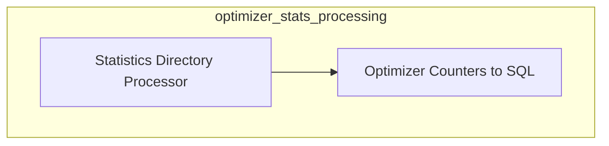

# Optimizer Statistics Processing Module

## Introduction

The `optimizer_stats_processing` module provides a suite of tools for collecting, processing, and analyzing compiler optimization statistics. It enables developers to gain insights into the performance and behavior of various compiler passes, aiding in performance tuning, identifying regressions, and understanding the impact of code changes. This module is a critical part of the larger [compiler_pass_analysis](compiler_pass_analysis.md) ecosystem, focusing specifically on quantitative data analysis.

## Architecture

The module is composed of two primary sub-modules, each serving a distinct but complementary role in the statistics processing pipeline:

<!-- DIAGRAM_JSON
{
    "direction": "TD",
    "nodes": [
        {"id": "optimizer_counters_to_sql_processor", "label": "Optimizer Counters to SQL", "type": "module", "link": "optimizer_counters_to_sql_processor.md"},
        {"id": "stats_directory_processor", "label": "Statistics Directory Processor", "type": "module", "link": "stats_directory_processor.md"}
    ],
    "edges": [
        {"source": "stats_directory_processor", "target": "optimizer_counters_to_sql_processor", "label": "Provides Data To"}
    ],
    "groups": []
}
-->

## Sub-modules

### [Optimizer Counters to SQL Processor](optimizer_counters_to_sql_processor.md)
This sub-module is responsible for taking raw optimizer counter data and persisting it into a SQL database. This allows for long-term storage, complex querying, and integration with other data analysis tools for historical trend analysis and performance tracking.

### [Statistics Directory Processor](stats_directory_processor.md)
The Statistics Directory Processor is a versatile tool for handling directories containing compiler statistics. It supports various operations such as comparing different sets of statistics, generating reports in multiple formats (e.g., LNT, Catapult, Markdown), and filtering data based on specific modules or statistics. It acts as the primary interface for initial data aggregation and comparison.
