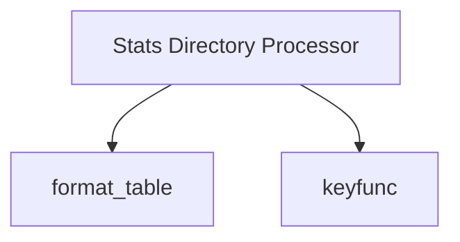

# output_utilities Module Documentation

The `output_utilities` module provides essential functions for formatting and organizing data outputs within the `stats_directory_processor`. It is primarily responsible for generating human-readable tables from processed statistics and providing a key function for data grouping.

## Core Functionality

*   ### `format_table`
    This function takes a list of elements (`elts`) and formats them into a markdown-style table. It writes the table headers (derived from `OutputRow._fields`), a separator line, and then each data row to the specified `args.output` stream. It utilizes a helper `format_field` function (not directly provided in this module's core components but implied) to format individual fields of each element.

*   ### `keyfunc`
    A utility function designed to extract the module name from an element's `name` attribute (e.g., `e.name`). This function is typically used as a key for sorting or grouping elements based on their originating module.

## Architecture

<!-- DIAGRAM_JSON
{
    "direction": "TD",
    "nodes": [
        {"id": "format_table", "label": "format_table", "type": "component", "link": null},
        {"id": "keyfunc", "label": "keyfunc", "type": "component", "link": null},
        {"id": "stats_directory_processor", "label": "Stats Directory Processor", "type": "external", "link": "stats_directory_processor.md"}
    ],
    "edges": [
        {"source": "stats_directory_processor", "target": "format_table"},
        {"source": "stats_directory_processor", "target": "keyfunc"}
    ],
    "groups": []
}
-->

## Module Integration

The `output_utilities` module is a crucial sub-component of the [stats_directory_processor](stats_directory_processor.md). Its `format_table` function is used by the `stats_directory_processor` to present collected and processed statistics in a clear, tabular format, making the output easily digestible for users and developers. The `keyfunc` aids in organizing these statistics, particularly when grouping data by module.

This module, therefore, plays a vital role in the `optimizer_stats_processing` and broader `compiler_pass_analysis` ecosystem by ensuring that the results of compiler pass optimizations and statistical analyses are communicated effectively.

For more details on how these utilities are used in the broader context, refer to the [stats_directory_processor.md](stats_directory_processor.md) documentation.