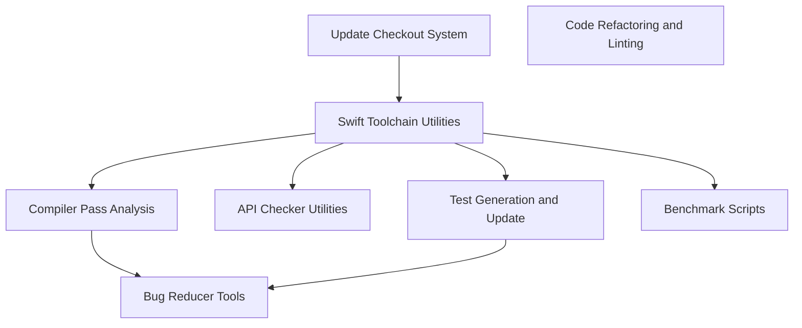

The `swift` repository houses a comprehensive suite of development tools and utilities designed to support the Swift compiler and ecosystem. It provides functionalities for compiler analysis, bug reduction, performance benchmarking, toolchain management, automated testing, API/ABI stability checks, and various developer productivity enhancements. This collection of tools streamlines the development, testing, and maintenance of the Swift language and its associated toolchains.

