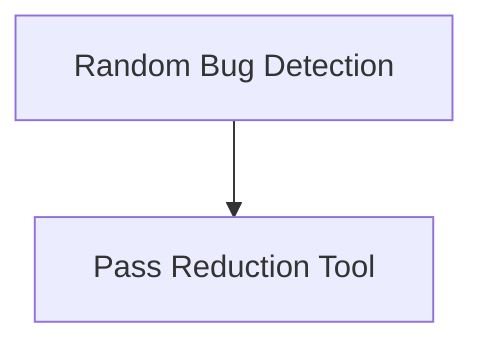

# Pass Reducer Module

## Introduction
The `pass_reducer` module is a vital component within the bug reduction tools, specifically designed to help identify and isolate issues related to Swift Intermediate Language (SIL) passes. It includes functionalities for both systematically reducing a list of passes to pinpoint the problematic one and randomly searching for pass combinations that trigger bugs or performance regressions.

## Architecture Overview
The `pass_reducer` module is composed of two primary sub-modules: the Pass Reduction Tool and the Random Bug Detection tool. The Random Bug Detection module can leverage the Pass Reduction Tool when a crash or failure is found with a randomly generated pass list to further reduce the problematic pass set.

<!-- DIAGRAM_JSON
{
    "direction": "TD",
    "nodes": [
        {"id": "pass_reduction_tool", "label": "Pass Reduction Tool", "type": "module", "link": "pass_reduction_tool.md"},
        {"id": "random_bug_detection", "label": "Random Bug Detection", "type": "module", "link": "random_bug_detection.md"}
    ],
    "edges": [
        {"source": "random_bug_detection", "target": "pass_reduction_tool"}
    ],
    "groups": []
}
-->

## Sub-modules

*   **[Pass Reduction Tool](pass_reduction_tool.md)**: This sub-module focuses on reducing a given list of optimization passes to find the minimal set that still reproduces a specific bug or performance characteristic.
*   **[Random Bug Detection](random_bug_detection.md)**: This sub-module systematically shuffles and applies passes to identify combinations that lead to failures or unexpected behavior. If a bug is found, it can then invoke the Pass Reduction Tool to narrow down the problematic passes.