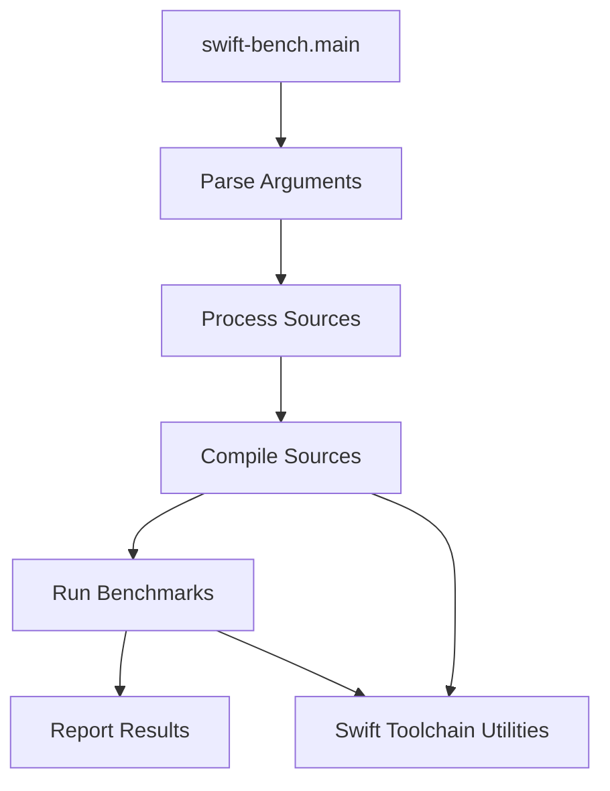

# Performance Benchmarking Module

## Introduction

The `performance_benchmarking` module provides tools and utilities for benchmarking the performance of Swift code. It utilizes the `swift-bench` utility to orchestrate the entire benchmarking workflow, from parsing arguments and processing source files to compiling, running, and reporting benchmark results.

## Core Functionality

The primary component of this module is `utils.swift-bench.main`, which serves as the entry point for executing performance benchmarks. It encapsulates the sequential steps required for a complete benchmarking run:

1.  **Argument Parsing**: Handles the command-line arguments and configuration for the benchmarking process.
2.  **Source Processing**: Prepares the source code for compilation and benchmarking.
3.  **Source Compilation**: Compiles the Swift source files into executable benchmarks. This step often relies on external Swift toolchain utilities.
4.  **Benchmark Execution**: Runs the compiled benchmarks to collect performance data.
5.  **Result Reporting**: Gathers and presents the performance results, which can be used for analysis and comparison.

## Architecture and Component Relationships

The `performance_benchmarking` module orchestrates the benchmarking process through a `SwiftBenchHarness` object. The `main` function initializes this harness and sequentially invokes its methods to perform the various stages of benchmarking.

This module is a child of the `swift_toolchain_utilities` module, indicating a dependency on the Swift toolchain for compilation and execution of benchmarks.

<!-- DIAGRAM_JSON
{
    "direction": "TD",
    "nodes": [
        {"id": "swift_bench_main", "label": "swift-bench.main", "type": "component", "link": null},
        {"id": "parse_arguments", "label": "Parse Arguments", "type": "component", "link": null},
        {"id": "process_sources", "label": "Process Sources", "type": "component", "link": null},
        {"id": "compile_sources", "label": "Compile Sources", "type": "component", "link": null},
        {"id": "run_benchmarks", "label": "Run Benchmarks", "type": "component", "link": null},
        {"id": "report_results", "label": "Report Results", "type": "component", "link": null},
        {"id": "swift_toolchain_utilities", "label": "Swift Toolchain Utilities", "type": "external", "link": "swift_toolchain_utilities.md"}
    ],
    "edges": [
        {"source": "swift_bench_main", "target": "parse_arguments"},
        {"source": "parse_arguments", "target": "process_sources"},
        {"source": "process_sources", "target": "compile_sources"},
        {"source": "compile_sources", "target": "run_benchmarks"},
        {"source": "run_benchmarks", "target": "report_results"},
        {"source": "compile_sources", "target": "swift_toolchain_utilities"},
        {"source": "run_benchmarks", "target": "swift_toolchain_utilities"}
    ],
    "groups": []
}
-->

## Integration with Overall System

The `performance_benchmarking` module plays a crucial role in the continuous integration and development pipeline by providing automated performance measurement capabilities. It integrates with the broader system by leveraging the [swift_toolchain_utilities](swift_toolchain_utilities.md) for compilation and execution, ensuring that performance benchmarks are run against consistent and up-to-date Swift toolchains. The results generated by this module are vital for identifying performance regressions or improvements across different code changes and toolchain versions.
