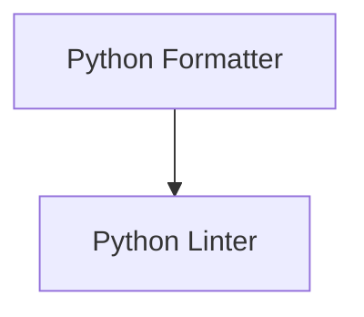

# Python Code Quality Module

## Introduction
The `python_code_quality` module provides tools and utilities to enforce code quality standards for Python projects. It integrates with external tools like Black for code formatting and Flake8 for linting, ensuring a consistent and high-quality codebase.

## Architecture
This module is composed of two main sub-modules: the `python_formatter` and the `python_linter`. The `python_formatter` handles automatic code formatting, while the `python_linter` is responsible for identifying and reporting code style and potential errors.

<!-- DIAGRAM_JSON
{
    "direction": "TD",
    "nodes": [
        {"id": "python_formatter", "label": "Python Formatter", "type": "module", "link": "python_formatter.md"},
        {"id": "python_linter", "label": "Python Linter", "type": "module", "link": "python_linter.md"}
    ],
    "edges": [
        {"source": "python_formatter", "target": "python_linter", "label": "can be used in conjunction with"}
    ],
    "groups": []
}
-->

## Sub-modules

### [Python Formatter](python_formatter.md)
This sub-module is responsible for automatically formatting Python code using the Black tool. It ensures that all Python files adhere to a consistent style, improving readability and maintainability.

### [Python Linter](python_linter.md)
This sub-module provides linting capabilities for Python code using Flake8. It identifies and reports on stylistic errors, potential bugs, and questionable constructs, helping to maintain high code quality.