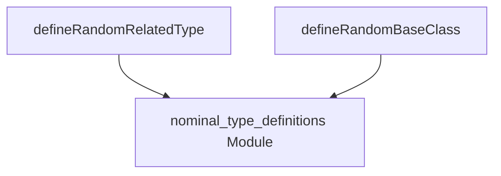

# random_type_definitions Module Documentation

## Introduction

The `random_type_definitions` module is a sub-module within the larger `compiler_pass_analysis` component, specifically part of the `type_layout_fuzzing` utility. Its primary role is to assist in the generation of random type definitions, focusing on related types and base classes, for the purpose of fuzz testing and analysis within the compiler.

## Purpose and Core Functionality

This module provides helper functions to define various random types, which are crucial for stress-testing the compiler's type layout and code generation. By programmatically generating diverse and complex type structures, it helps uncover potential bugs and inconsistencies in how the compiler handles different type layouts and inheritance hierarchies.

The core functionalities include:

*   **`defineRandomRelatedType`**: Generates a random nominal type (e.g., struct, enum, class) that is "related" in some way, often by invoking `defineRandomNominalType` from a related module.
*   **`defineRandomBaseClass`**: Generates a random base class definition, which is essential for testing inheritance and polymorphism within the fuzzer.

## Architecture and Component Relationships

The `random_type_definitions` module acts as a specialized utility within the `type_generation_helpers` module, providing specific functions for creating related types and base classes. It depends on other components within the `type_layout_fuzzing` ecosystem for the actual definition of nominal types and classes.

<!-- DIAGRAM_JSON
{
    "direction": "TD",
    "nodes": [
        {"id": "define_random_related_type", "label": "defineRandomRelatedType", "type": "component", "link": null},
        {"id": "define_random_base_class", "label": "defineRandomBaseClass", "type": "component", "link": null},
        {"id": "nominal_type_definitions", "label": "nominal_type_definitions Module", "type": "external", "link": "nominal_type_definitions.md"}
    ],
    "edges": [
        {"source": "define_random_related_type", "target": "nominal_type_definitions"},
        {"source": "define_random_base_class", "target": "nominal_type_definitions"}
    ],
    "groups": []
}
-->

## How the Module Fits into the Overall System

This module is a crucial part of the `type_layout_fuzzing` system, which aims to thoroughly test the compiler's handling of various type layouts. The functions provided here (`defineRandomRelatedType` and `defineRandomBaseClass`) are invoked by higher-level fuzzer logic within `type_layout_fuzzing` and its parent `type_generation_helpers` to construct a rich and unpredictable set of types for analysis. By providing these basic building blocks for type generation, `random_type_definitions` directly contributes to the robustness and reliability of the Swift compiler by helping to identify edge cases and bugs related to type system implementations.
