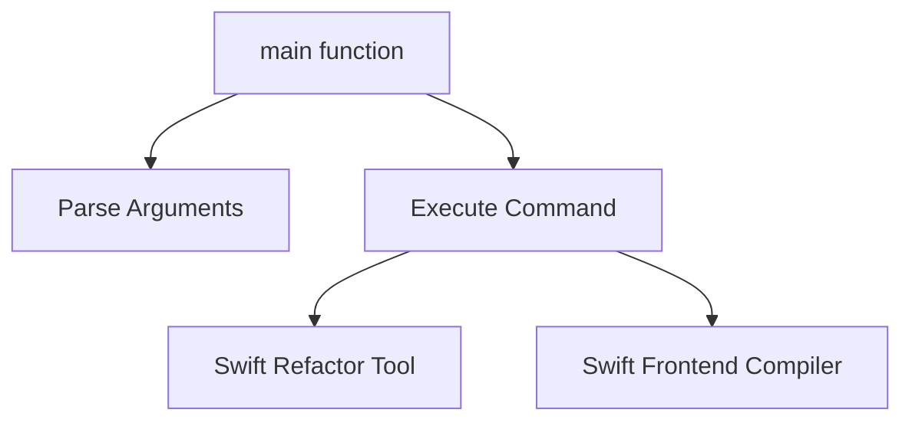

# Module: `refactor_compilation_check`

## Introduction
The `refactor_compilation_check` module is a critical utility within the Swift development toolchain, specifically designed to ensure the integrity of refactoring operations. It automates the process of applying refactoring edits to a Swift source file and subsequently verifying that the modified file still compiles without errors. This module plays a vital role in maintaining code quality and preventing the introduction of compilation regressions during automated code transformations.

## Module Purpose and Core Functionality
The primary purpose of `refactor_compilation_check` is to provide a robust mechanism for validating refactored Swift code. Its core functionality revolves around two main steps:

1.  **Apply Refactoring Edits**: It utilizes the `swift-refactor` tool to apply a set of specified refactoring edits to a given Swift source file. The output of this operation is a rewritten source file.
2.  **Type-Check Rewritten File**: After the edits are applied, the module invokes the `swift-frontend` compiler in type-checking mode on the newly generated file. This step ensures that the refactored code adheres to Swift's syntax and semantic rules, confirming that the refactoring did not introduce any compilation errors.

This two-step process is crucial for developers and automated systems performing large-scale refactorings, as it provides immediate feedback on the correctness of the changes.

## Architecture and Component Relationships

The `refactor_compilation_check` module is a leaf module focusing on a specific task within the broader `swift_code_utilities` set. Its architecture is straightforward, orchestrating calls to external Swift tools.

<!-- DIAGRAM_JSON
{
    "direction": "TD",
    "nodes": [
        {"id": "refactor_main", "label": "main function", "type": "component", "link": null},
        {"id": "parse_args", "label": "Parse Arguments", "type": "component", "link": null},
        {"id": "run_cmd", "label": "Execute Command", "type": "component", "link": null},
        {"id": "swift_refactor_tool", "label": "Swift Refactor Tool", "type": "external", "link": null},
        {"id": "swift_frontend_tool", "label": "Swift Frontend Compiler", "type": "external", "link": null}
    ],
    "edges": [
        {"source": "refactor_main", "target": "parse_args"},
        {"source": "refactor_main", "target": "run_cmd"},
        {"source": "run_cmd", "target": "swift_refactor_tool"},
        {"source": "run_cmd", "target": "swift_frontend_tool"}
    ],
    "groups": []
}
-->

### Core Component: `utils.refactor-check-compiles.main`

This is the entry point and orchestrator of the module.
- It parses command-line arguments, including the source file, position for refactoring, temporary directory, and various Swift compiler flags (e.g., `-I`, `-sdk`, `-target`).
- It constructs a temporary file path for the rewritten code.
- It executes the `swift-refactor -dump-text` command to apply the refactoring and save the rewritten code to the temporary file.
- It then executes the `swift-frontend -typecheck` command on the temporary file to verify its compilation status.

## How the Module Fits into the Overall System

The `refactor_compilation_check` module is an integral part of the `swift_code_utilities` sub-system, which itself is nested within `code_refactoring_and_linting`. Its primary role is to ensure that automated or semi-automated refactoring tools do not break the compilation of Swift projects.

It supports:
- **Automated Refactoring Tools**: By providing a compile-time check, it helps build robust refactoring pipelines.
- **Developer Workflows**: Developers can use this utility to quickly validate their refactoring changes before committing.
- **CI/CD Systems**: It can be integrated into continuous integration systems to prevent refactoring-induced build failures.

This module works in conjunction with other `swift_code_utilities` like [fixit_application](fixit_application.md), which might apply edits that also need compilation verification, and [confusable_generation](confusable_generation.md), although its connection to the latter is less direct. It ensures the reliability and correctness of code transformations within the Swift ecosystem.
