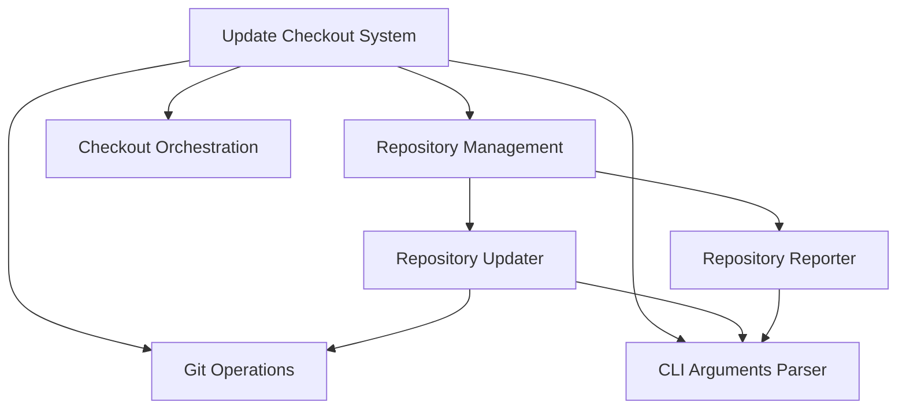

# Repository Management Module

## Introduction
The `repository_management` module is a crucial component within the larger `update_checkout_system`. Its primary responsibility is to manage the lifecycle of individual repositories within a multi-repository environment. This includes updating repositories to a specified state (branch, tag, commit, or timestamp) and reporting their current state.

## Architecture Overview
The `repository_management` module orchestrates the update process for individual repositories, interacting with Git operations and command-line argument parsing. It consists of two main sub-modules: the `repository_updater` which handles the actual Git commands for updating, and the `repository_reporter` which provides functionality to display repository information.

<!-- DIAGRAM_JSON
{
    "direction": "TD",
    "nodes": [
        {"id": "update_checkout_system", "label": "Update Checkout System", "type": "module", "link": "update_checkout_system.md"},
        {"id": "repository_management", "label": "Repository Management", "type": "module", "link": "repository_management.md"},
        {"id": "git_operations", "label": "Git Operations", "type": "module", "link": "git_operations.md"},
        {"id": "cli_arguments_parser", "label": "CLI Arguments Parser", "type": "module", "link": "cli_arguments_parser.md"},
        {"id": "checkout_orchestration", "label": "Checkout Orchestration", "type": "module", "link": "checkout_orchestration.md"},
        {"id": "repository_updater", "label": "Repository Updater", "type": "module", "link": "repository_updater.md"},
        {"id": "repository_reporter", "label": "Repository Reporter", "type": "module", "link": "repository_reporter.md"}
    ],
    "edges": [
        {"source": "update_checkout_system", "target": "repository_management"},
        {"source": "update_checkout_system", "target": "git_operations"},
        {"source": "update_checkout_system", "target": "cli_arguments_parser"},
        {"source": "update_checkout_system", "target": "checkout_orchestration"},
        {"source": "repository_management", "target": "repository_updater"},
        {"source": "repository_management", "target": "repository_reporter"},
        {"source": "repository_updater", "target": "git_operations"},
        {"source": "repository_updater", "target": "cli_arguments_parser"},
        {"source": "repository_reporter", "target": "cli_arguments_parser"}
    ],
    "groups": []
}
-->

## Sub-modules

### [Repository Updater](repository_updater.md)
The `repository_updater` sub-module encapsulates the core logic for updating a single Git repository. It handles various operations such as fetching, checking out specific branches, tags, or commits, cleaning the working directory, stashing changes, and rebasing the repository. It interacts heavily with the [Git Operations](git_operations.md) module to execute Git commands and relies on the [CLI Arguments Parser](cli_arguments_parser.md) for configuration.

### [Repository Reporter](repository_reporter.md)
The `repository_reporter` sub-module provides functionality to generate and display the current hashes of all managed repositories. It formats the output for clear readability and is primarily used for informational and debugging purposes. It also depends on the [CLI Arguments Parser](cli_arguments_parser.md) to retrieve necessary arguments and configurations.
