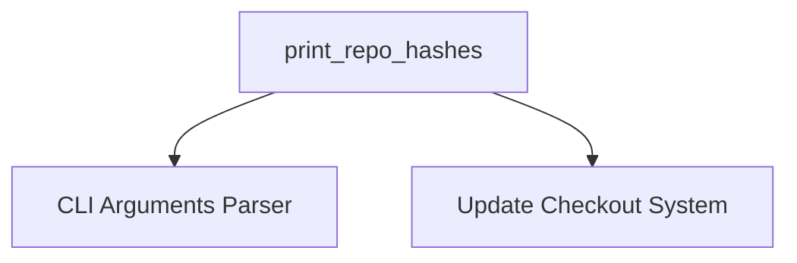

# `repository_reporter` Module Documentation

## Introduction

The `repository_reporter` module is a vital component within the larger `update_checkout_system`. Its primary function is to provide a clear and organized report of the current Git hashes for all managed repositories. This module helps users and automated systems quickly ascertain the state of the checked-out repositories, ensuring transparency and facilitating version tracking.

## Purpose and Core Functionality

The core purpose of the `repository_reporter` module is to generate a formatted list of repository names and their corresponding Git commit hashes. This output is crucial for:

*   **Version Tracking:** Easily identifying the exact commit a repository is currently at.
*   **Debugging:** Pinpointing specific repository versions when troubleshooting issues.
*   **Auditing:** Providing a record of repository states at a given time.
*   **Synchronization Verification:** Helping to confirm that all repositories are at expected versions.

### Core Components

#### `print_repo_hashes`

This function is the central piece of the `repository_reporter` module. It takes command-line arguments and configuration settings, then fetches the current Git hashes for all repositories and prints them to standard output in a human-readable, sorted format.

**Key Actions:**
*   Retrieves repository information and hashes via an internal `repo_hashes` function (part of the broader `update_checkout_system`).
*   Determines the maximum length of repository names for consistent formatting.
*   Prints each repository name and its hash, aligned for readability.

## Architecture and Component Relationships

The `repository_reporter` module is a leaf module within the `update_checkout_system`'s `repository_management` sub-module. It directly interacts with the core logic that retrieves repository hashes and relies on external modules for argument parsing.

<!-- DIAGRAM_JSON
{
    "direction": "TD",
    "nodes": [
        {"id": "print_repo_hashes", "label": "print_repo_hashes", "type": "component", "link": null},
        {"id": "cli_arguments_parser", "label": "CLI Arguments Parser", "type": "external", "link": "cli_arguments_parser.md"},
        {"id": "update_checkout_system", "label": "Update Checkout System", "type": "external", "link": "update_checkout_system.md"}
    ],
    "edges": [
        {"source": "print_repo_hashes", "target": "cli_arguments_parser"},
        {"source": "print_repo_hashes", "target": "update_checkout_system"}
    ],
    "groups": []
}
-->

## How the Module Fits into the Overall System

The `repository_reporter` module plays a reporting role within the `update_checkout_system`. It provides visibility into the state of repositories managed by the system without performing any modifications. It is typically invoked after an update operation (managed by `checkout_orchestration` and `repository_updater`) or when a user simply wants to query the current repository versions.

Its dependency on the `cli_arguments_parser` module ensures that it can correctly interpret command-line inputs, making it a flexible tool for various reporting scenarios. It complements the `repository_updater` module by providing feedback on the outcomes of repository updates.

For more details on argument parsing, refer to the [cli_arguments_parser module documentation](cli_arguments_parser.md).
For an understanding of the overall checkout process, refer to the [update_checkout_system module documentation](update_checkout_system.md).
For information on updating individual repositories, refer to the [repository_updater module documentation](repository_updater.md).
