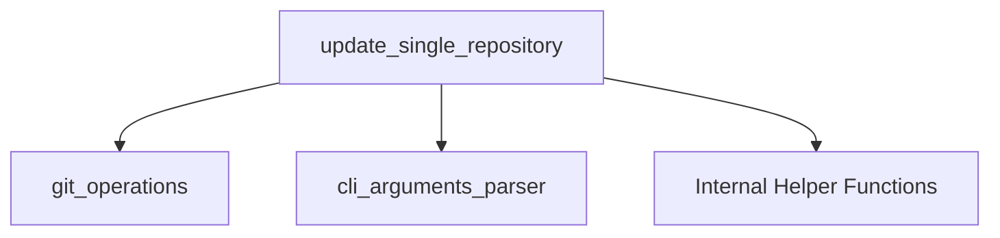

# Repository Updater Module

## Introduction

The `repository_updater` module is a crucial component of the `update_checkout_system`, specifically nested within the `repository_management` sub-system. Its primary responsibility is to manage the update process for individual Git repositories. It handles fetching new changes, cleaning or stashing local modifications, checking out specific branches or tags, and rebasing the repository against the fetched changes.

## Architecture and Component Relationships

This module encapsulates the core logic for performing a comprehensive update of a single Git repository. It orchestrates various Git commands and internal helper functions to ensure the repository is brought to the desired state, whether it's updating to a specific branch, tag, or timestamp.

### Core Functionality

The central function of this module is `update_single_repository`. This function takes `UpdateArguments` as input, which dictates how the repository should be updated (e.g., skip history, partial clone, clean, stash, target branch/tag, timestamp).

The `update_single_repository` function performs the following high-level steps:
1.  **Repository Validation**: Checks if the provided path is a valid Git repository.
2.  **Pre-update Cleanup**: Optionally stashes, resets, or cleans the repository and its submodules based on user arguments (`--clean`, `--stash`). It also attempts to abort any ongoing rebase operations.
3.  **Target Resolution**: Determines the target branch, tag, or commit to check out based on the provided arguments (tag, scheme name, timestamp).
4.  **Fetching and Checkout**: Fetches the necessary references (tags, branches) from the remote and then checks out the resolved target.
5.  **Rebasing**: If not in a detached HEAD state (e.g., after checking out a tag), it rebases the current branch onto the fetched changes to integrate updates cleanly.
6.  **Submodule Update**: Recursively updates all submodules to ensure consistency.

### Dependencies

-   **[Git Operations](git_operations.md)**: The `repository_updater` heavily relies on the `git_operations` module for executing all Git commands (e.g., `fetch`, `checkout`, `rebase`, `status`). The `Git.run` function is used extensively throughout `update_single_repository`.
-   **[CLI Arguments Parser](cli_arguments_parser.md)**: It depends on the `cli_arguments_parser` module to parse and encapsulate the command-line arguments into an `UpdateArguments` object, which guides the update process.

### Internal Components

The `update_single_repository` function also utilizes several internal helper functions (not explicitly listed as separate core components in the module tree but co-located in the same file) to assist with specific tasks such as confirming tags, getting branches for schemes, finding revisions by timestamp, and determining full target names. These functions are integral to the module's operation but are not exposed as public interfaces.

## How it Fits into the Overall System

The `repository_updater` module is a leaf module within the `update_checkout_system`'s hierarchical structure. It resides under `repository_management`, which, along with `repository_reporter`, collectively handles the individual repository-level operations during a multi-repository update. The `checkout_orchestration` module is responsible for coordinating the updates across multiple repositories by invoking the `update_single_repository` function for each.

This modular design ensures that the complex logic of updating a single repository is isolated and reusable, making the overall `update_checkout_system` robust and maintainable.

<!-- DIAGRAM_JSON
{
    "direction": "TD",
    "nodes": [
        {"id": "updater", "label": "update_single_repository", "type": "component", "link": null},
        {"id": "helpers", "label": "Internal Helper Functions", "type": "component", "link": null},
        {"id": "git_ops", "label": "git_operations", "type": "external", "link": "git_operations.md"},
        {"id": "cli_parser", "label": "cli_arguments_parser", "type": "external", "link": "cli_arguments_parser.md"}
    ],
    "edges": [
        {"source": "updater", "target": "git_ops"},
        {"source": "updater", "target": "cli_parser"},
        {"source": "updater", "target": "helpers"}
    ],
    "groups": []
}
-->

