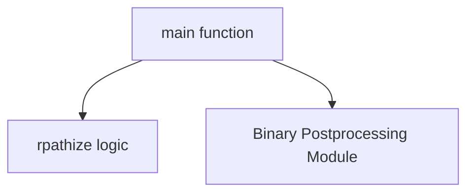

# rpath_management Module Documentation

## Introduction

The `rpath_management` module is a crucial utility within the `swift_toolchain_utilities` system, specifically designed for modifying the `rpath` (run-time search path) entries in Mach-O binaries. This module ensures that executables and libraries can correctly locate their dependencies at runtime, particularly in complex deployment scenarios where absolute paths might not be suitable.

## Purpose and Core Functionality

The primary purpose of the `rpath_management` module is to replace absolute install names in Mach-O binaries with `@rpath` relative paths. This transformation is essential for creating relocatable binaries that can be deployed in various locations without requiring recompilation or manual path adjustments. By using `@rpath`, the dynamic linker can resolve dependencies based on a search path embedded within the binary itself, providing greater flexibility and maintainability.

The core functionality is encapsulated in the `utils.swift-rpathize.main` component, which parses command-line arguments and invokes the underlying `rpathize` logic to perform the necessary modifications on the specified binary.

## Architecture and Component Relationships

The `rpath_management` module is a self-contained unit responsible for a specific binary post-processing task. Its architecture is straightforward, with a main entry point orchestrating the `rpath` modification process.

<!-- DIAGRAM_JSON
{
    "direction": "TD",
    "nodes": [
        {"id": "main_entry", "label": "main function", "type": "component", "link": null},
        {"id": "rpathize_logic", "label": "rpathize logic", "type": "component", "link": null},
        {"id": "binary_postprocessing", "label": "Binary Postprocessing Module", "type": "external", "link": "binary_postprocessing.md"}
    ],
    "edges": [
        {"source": "main_entry", "target": "rpathize_logic"},
        {"source": "main_entry", "target": "binary_postprocessing"}
    ],
    "groups": []
}
-->

### Components

*   **`main` function (`utils.swift-rpathize.main`)**: This is the command-line interface for the `rpath_management` module. It is responsible for parsing input arguments (specifically, the path to the binary to be processed) and initiating the `rpathize` operation.
*   **`rpathize` logic**: This internal function (implicitly called by `main`) contains the core logic for inspecting the Mach-O binary, identifying absolute install names, and replacing them with `@rpath` entries.

## How the Module Fits into the Overall System

The `rpath_management` module is an integral part of the [binary_postprocessing](binary_postprocessing.md) module, which in turn belongs to the broader [toolchain_management](toolchain_management.md) and [swift_toolchain_utilities](swift_toolchain_utilities.md) system. Its role is critical in the final stages of toolchain and binary preparation, ensuring that generated Swift binaries are correctly configured for deployment and runtime execution across different environments.

By converting absolute paths to `@rpath`, this module contributes to the portability and flexibility of the Swift toolchain, making it easier to distribute and use Swift applications and libraries without strict adherence to specific installation directories. It works in conjunction with other binary post-processing utilities to finalize the structure and linking behavior of compiled artifacts.
