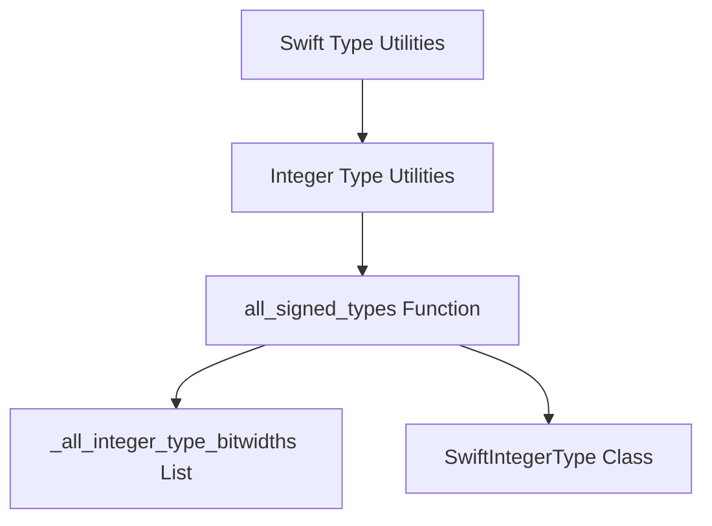

# Module: signed_type_generation

## Introduction
The `signed_type_generation` module is a specialized utility within the broader `integer_type_utilities` and `swift_type_utilities` ecosystem. Its primary function is to systematically generate representations of all standard signed integer types used in Swift, including both fixed-width and "word-sized" signed integers. This module is essential for tools that require a comprehensive understanding or enumeration of Swift's signed integer landscape, facilitating tasks such as type analysis, code generation, and testing across different integer bitwidths.

## Core Functionality

The core functionality of this module is encapsulated in the `all_signed_types` function, located in `utils/SwiftIntTypes.py`.

### `all_signed_types(word_bits)`

This generator function provides an iterable sequence of `SwiftIntegerType` objects, each representing a distinct signed integer type.

**Parameters:**
- `word_bits`: An integer specifying the bitwidth for the "word-sized" signed integer type (e.g., 32 for Int32, 64 for Int64 on typical architectures).

**Behavior:**
1.  **Fixed-width Signed Integers:** It iterates through a predefined list of integer bitwidths (likely `_all_integer_type_bitwidths` from the same module) and, for each bitwidth, yields a `SwiftIntegerType` instance configured as a fixed-width signed integer.
2.  **Word-sized Signed Integer:** After yielding all fixed-width types, it yields one additional `SwiftIntegerType` instance representing a "word-sized" signed integer, whose bitwidth is determined by the `word_bits` parameter. This accounts for types like Swift's `Int` which adapts its size based on the target architecture's word size.

**Example Usage (Conceptual):**
```python
# Assuming SwiftIntegerType and _all_integer_type_bitwidths are available
# from utils.SwiftIntTypes

# for signed_type in all_signed_types(word_bits=64):
#     print(f"Generated Signed Type: IsWord={signed_type.is_word}, "
#           f"Bits={signed_type.bits}, IsSigned={signed_type.is_signed}")
```

## Architecture and Component Relationships

The `signed_type_generation` module, though focused on a single primary function, relies on internal data structures and type definitions. It serves as a leaf module within the `integer_type_utilities` hierarchy, making its generated types available for higher-level modules.

<!-- DIAGRAM_JSON
{
    "direction": "TD",
    "nodes": [
        {"id": "all_signed_types_func", "label": "all_signed_types Function", "type": "component", "link": null},
        {"id": "swift_int_type_class", "label": "SwiftIntegerType Class", "type": "component", "link": null},
        {"id": "bitwidths_list", "label": "_all_integer_type_bitwidths List", "type": "component", "link": null},
        {"id": "integer_type_utilities", "label": "Integer Type Utilities", "type": "external", "link": "integer_type_utilities.md"},
        {"id": "swift_type_utilities", "label": "Swift Type Utilities", "type": "external", "link": "swift_type_utilities.md"}
    ],
    "edges": [
        {"source": "all_signed_types_func", "target": "bitwidths_list"},
        {"source": "all_signed_types_func", "target": "swift_int_type_class"},
        {"source": "integer_type_utilities", "target": "all_signed_types_func"},
        {"source": "swift_type_utilities", "target": "integer_type_utilities"}
    ],
    "groups": []
}
-->


## Integration with Overall System

The `signed_type_generation` module plays a foundational role in any system component that needs to interact with or enumerate Swift's signed integer types. It directly feeds into:

*   **[integer_type_utilities.md](integer_type_utilities.md)**: As a sub-module, its output (the generated signed integer types) is a direct input or resource for other functions within the broader integer type utilities.
*   **[swift_type_utilities.md](swift_type_utilities.md)**: The types generated here contribute to the overall understanding and manipulation of Swift types managed by the `swift_type_utilities` module.
*   **Testing and Analysis Tools**: Modules involved in generating test cases, performing static analysis, or verifying compiler behavior related to integer types would leverage the `all_signed_types` function to ensure comprehensive coverage.
*   **Code Generation**: Any tool responsible for emitting Swift code that involves signed integers might use this module to ensure correct and complete type specification.
