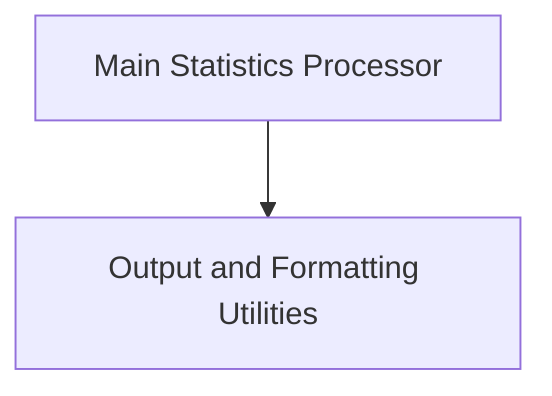

# Stats Directory Processor Module

## Introduction

The `stats_directory_processor` module is a crucial utility within the compiler pass analysis suite, specifically designed to process and analyze statistics generated by the Swift compiler. It provides functionalities for comparing statistics directories, generating various report formats (including LNT and Catapult traces), and aiding in performance analysis and regression detection.

This module is part of the larger [compiler_pass_analysis.md](compiler_pass_analysis.md) module, focusing on the detailed examination and presentation of compiler-generated performance and counter statistics.

## Architecture Overview

The `stats_directory_processor` module is structured into two main sub-modules, each handling a distinct aspect of the statistics processing workflow:

<!-- DIAGRAM_JSON
{
    "direction": "TD",
    "nodes": [
        {"id": "main_processor", "label": "Main Statistics Processor", "type": "module", "link": "main_processor.md"},
        {"id": "output_utilities", "label": "Output and Formatting Utilities", "type": "module", "link": "output_utilities.md"}
    ],
    "edges": [
        {"source": "main_processor", "target": "output_utilities"}
    ],
    "groups": []
}
-->

## Sub-modules

### [Main Statistics Processor](main_processor.md)
This sub-module (`main_processor`) serves as the primary entry point for the `stats_directory_processor`. It is responsible for parsing command-line arguments, validating inputs, and orchestrating the overall flow of statistics processing based on the user's selected mode of operation (e.g., comparison, LNT emission, Catapult tracing, baseline management).

### [Output and Formatting Utilities](output_utilities.md)
This sub-module (`output_utilities`) provides essential helper functions for formatting the processed statistics into human-readable or machine-parsable outputs. It includes utilities for rendering data in tables (e.g., Markdown format) and defining key functions for grouping and sorting statistics, which are crucial for generating coherent reports and comparisons.
