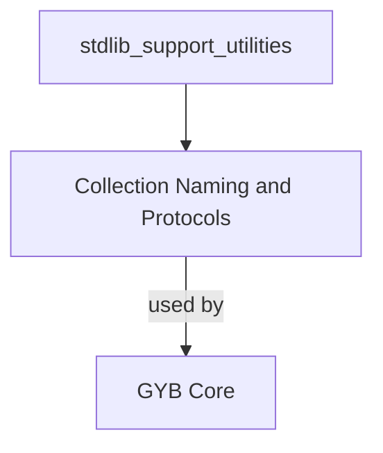

# stdlib_support_utilities Module Documentation

## Introduction and Purpose

The `stdlib_support_utilities` module provides essential utilities for assisting the GYB (Generate Your Boilerplate) system, specifically in the context of generating code for Swift's standard library collections. Its primary role is to dynamically determine appropriate collection type names and their conforming protocols based on various features like traversal capabilities, mutability, and range replaceability.

This module plays a crucial role in ensuring that the GYB-generated code accurately reflects the characteristics and protocol conformance of different collection types within the Swift standard library, thereby simplifying the boilerplate generation process.

## Architecture Overview

The `stdlib_support_utilities` module primarily consists of a single sub-module that encapsulates the logic for collection naming and protocol identification. It integrates with the broader `gyb_tools` module, providing specialized support for standard library-related code generation.

<!-- DIAGRAM_JSON
{
    "direction": "TD",
    "nodes": [
        {"id": "collection_naming_and_protocols", "label": "Collection Naming and Protocols", "type": "module", "link": "collection_naming_and_protocols.md"},
        {"id": "gyb_core", "label": "GYB Core", "type": "module", "link": "gyb_core.md"}
    ],
    "edges": [
        {"source": "collection_naming_and_protocols", "target": "gyb_core", "label": "used by"}
    ],
    "groups": []
}
-->

## Sub-modules

### [Collection Naming and Protocols](collection_naming_and_protocols.md)
This sub-module centralizes the logic for deriving collection type names and identifying the set of Swift protocols they should conform to. It takes into account properties such as whether a collection is mutable, supports range replacement, and its traversal characteristics. This functionality is critical for generating precise and correct boilerplate code for diverse collection types within the Swift standard library.

